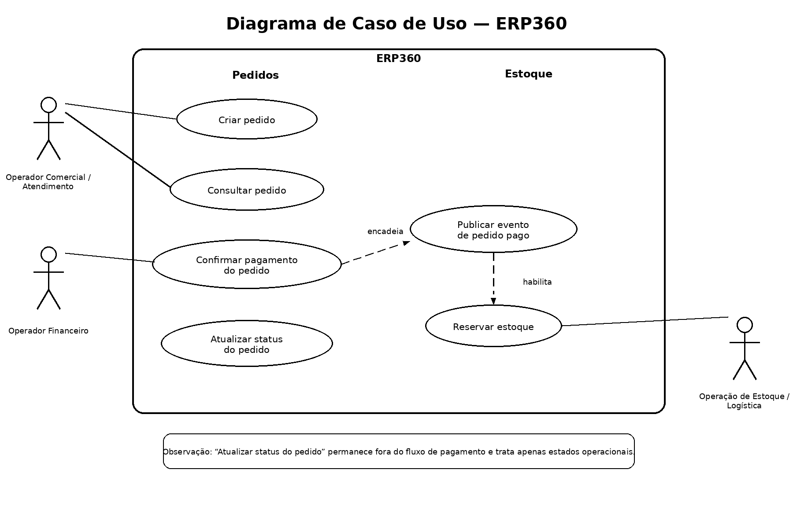

# 03. Modelo de Casos de Uso

## Artefatos visuais desta seção

### Diagrama de Caso de Uso

## 3.1 Objetivo desta seção

Esta seção formaliza o modelo de casos de uso do ERP360 no estado atual do projeto. O objetivo aqui é registrar, em nível funcional:

- quais atores interagem com o sistema

- quais casos de uso estão implementados no recorte atual

- como esses atores se relacionam com os casos

- quais dependências existem entre os casos de uso principais

Esta seção não substitui a modelagem conceitual, a arquitetura nem os diagramas comportamentais. Seu papel é apresentar a visão funcional do sistema a partir das interações externas e dos casos de uso já materializados no ERP360.

## 3.2 Critério de modelagem adotado

Para manter o modelo consistente, esta seção considera como atores apenas:

- pessoas ou papéis externos ao sistema

- sistemas externos quando sua participação for funcionalmente relevante

Os módulos internos do ERP360, como Pedidos e Estoque, não serão tratados aqui como atores formais. Eles pertencem à estrutura interna da solução e são melhor explicados nas seções de arquitetura e implementação.

## 3.3 Lista de atores

### 3.3.1 Atores humanos

**AT-01 — Operador Comercial / Atendimento**

Ator responsável por registrar e consultar pedidos.

**AT-02 — Operador Financeiro**

Ator responsável por confirmar o pagamento de pedidos.

**AT-03 — Operação de Estoque / Logística**

Ator funcionalmente interessado no resultado da reserva de estoque, embora o acionamento atual desse fluxo seja sistêmico e não manual.

### 3.3.2 Ator sistêmico externo

**AT-04 — Barramento de Mensagens / RabbitMQ**

Ator externo de integração responsável por transportar o evento PedidoPago entre os contextos.

**Observação importante**

O RabbitMQ não é tratado aqui como “ator de negócio”, mas sua presença como participante externo faz sentido para o modelo funcional porque ele participa do encadeamento entre confirmação de pagamento e reserva de estoque.

## 3.4 Lista de casos de uso

**UC-01 — Criar pedido**

O sistema deve permitir registrar um novo pedido com cliente e itens.

**Objetivo**

Iniciar formalmente o ciclo do pedido no sistema.

**Resultado esperado**

Pedido criado e persistido com sucesso.

**UC-02 — Consultar pedido**

O sistema deve permitir recuperar os dados de um pedido existente para leitura.

**Objetivo**

Permitir visualização do pedido, seu status e seus itens.

**Resultado esperado**

Dados do pedido retornados em formato de consulta.

**UC-03 — Confirmar pagamento do pedido**

O sistema deve permitir registrar a confirmação de pagamento de um pedido existente por meio de um caso de uso específico.

**Objetivo**

Formalizar o pagamento do pedido e produzir a transição oficial para Pago.

**Resultado esperado**

Pedido com status atualizado para Pago, persistido corretamente e com disparo do fluxo de integração correspondente.

**UC-04 — Atualizar status do pedido**

O sistema deve permitir que o status do pedido evolua segundo as regras válidas do domínio para os estados operacionais do ciclo, excluindo a transição para Pago.

**Objetivo**

Controlar a evolução operacional do pedido ao longo do fluxo.

**Resultado esperado**

Mudança de status operacional validada e persistida.

**UC-05 — Publicar evento de pedido pago**

O sistema deve publicar um evento de integração quando o caso de uso de confirmação de pagamento for concluído com sucesso.

**Objetivo**

Comunicar ao restante da solução que o pagamento foi confirmado e que o fluxo de reserva deve começar.

**Resultado esperado**

Evento PedidoPago publicado com os dados necessários para processamento posterior.

**UC-06 — Reservar estoque**

O sistema deve processar a reserva dos itens do pedido no contexto de Estoque a partir do evento recebido.

**Objetivo**

Reduzir a disponibilidade dos produtos após a confirmação de pagamento.

**Resultado esperado**

Reserva realizada e persistida no módulo de Estoque.

## 3.5 Relação entre atores e casos de uso

**AT-01 — Operador Comercial / Atendimento**

Relaciona-se com:

- UC-01 — Criar pedido

- UC-02 — Consultar pedido

**Justificativa**

Esse ator representa a entrada operacional principal do fluxo comercial do pedido.

**AT-02 — Operador Financeiro**

Relaciona-se com:

- UC-03 — Confirmar pagamento do pedido

**Justificativa**

Esse ator representa a confirmação formal da etapa financeira no fluxo atual.

**AT-03 — Operação de Estoque / Logística**

Relaciona-se com:

- UC-06 — Reservar estoque (em sentido funcional e operacional, não como acionamento manual direto no fluxo atual)

**Justificativa**

Esse ator representa a área interessada no efeito da reserva de estoque.

**AT-04 — Barramento de Mensagens / RabbitMQ**

Relaciona-se com:

- UC-05 — Publicar evento de pedido pago

- UC-06 — Reservar estoque

**Justificativa**

O barramento participa funcionalmente da transição entre os dois casos de uso, transportando o evento publicado por Pedidos até o ponto de consumo em Estoque.

## 3.6 Dependências entre casos de uso

**UC-01 — Criar pedido**

Dependências anteriores: nenhuma.

Dependências posteriores relevantes:

- habilita UC-02 — Consultar pedido

- habilita UC-03 — Confirmar pagamento do pedido

- habilita UC-04 — Atualizar status do pedido

**UC-02 — Consultar pedido**

Dependência anterior:

- depende da existência de um pedido criado em UC-01 — Criar pedido

Observação:
É um caso de uso de leitura e não dispara outros fluxos do sistema.

**UC-03 — Confirmar pagamento do pedido**

Dependência anterior:

- depende da existência de um pedido criado em UC-01 — Criar pedido

Dependência lógica de domínio:

- depende de o pedido estar em condição válida para receber confirmação de pagamento

Dependência posterior exclusiva:

- aciona UC-05 — Publicar evento de pedido pago

**UC-04 — Atualizar status do pedido**

Dependência anterior:

- depende da existência de um pedido criado em UC-01 — Criar pedido

Dependência lógica de domínio:

- depende de o status atual permitir a transição desejada dentro do conjunto de estados operacionais admitidos por esse caso de uso

Observação:
Esse caso de uso não leva o pedido para Pago e não dispara o evento PedidoPago.

**UC-05 — Publicar evento de pedido pago**

Dependência anterior:

- depende da conclusão bem-sucedida de UC-03 — Confirmar pagamento do pedido

Dependência posterior:

- habilita UC-06 — Reservar estoque

**UC-06 — Reservar estoque**

Dependência anterior:

- depende do recebimento do evento publicado em UC-05 — Publicar evento de pedido pago

Dependências lógicas internas:

- depende de os produtos informados existirem no estoque

- depende de haver quantidade disponível para reserva

## 3.7 Leitura consolidada das dependências

O encadeamento principal dos casos de uso, no estado atual do ERP360, é o seguinte:

UC-01 Criar pedido
→ permite UC-02 Consultar pedido
→ permite UC-03 Confirmar pagamento do pedido
→ que aciona de forma exclusiva UC-05 Publicar evento de pedido pago
→ que habilita UC-06 Reservar estoque

Em paralelo, o pedido também participa de:

UC-04 Atualizar status do pedido,
desde que a transição desejada seja válida segundo as regras do domínio e não corresponda ao pagamento.

## 3.8 Observações de modelagem

### 3.8.1 Nem todo caso de uso nasce de um ator humano

No ERP360 atual, os casos de uso de início do fluxo são acionados por atores humanos, mas a integração entre Pedidos e Estoque segue por participação sistêmica do barramento e do consumidor do evento.

### 3.8.2 Pagamento confirmado é caso de uso especializado

A confirmação de pagamento não é tratada como atualização genérica de status. Ela possui caso de uso próprio e encadeamento próprio de integração.

### 3.8.3 Reserva de estoque pertence ao contexto de reação

A reserva não é continuação interna do módulo de Pedidos. Ela acontece como consequência funcional do evento publicado após o pagamento confirmado.

## 3.9 Proposta de estrutura do diagrama de caso de uso

Agora que o modelo textual está consolidado, a estrutura recomendada para o diagrama é a seguinte.

### 3.9.1 Limite do sistema

O diagrama deve usar como fronteira principal o sistema:

**ERP360**

Dentro dessa fronteira, os casos de uso podem ser agrupados visualmente por área funcional:

- Pedidos

- Estoque

Esses agrupamentos não são atores. São apenas organização interna da leitura.

### 3.9.2 Atores que devem aparecer no diagrama

**Atores humanos**

- Operador Comercial / Atendimento

- Operador Financeiro

- Operação de Estoque / Logística (opcional, se a intenção for destacar a área impactada pela reserva)

**Ator sistêmico externo**

- Barramento de Mensagens / RabbitMQ (opcional, se o diagrama precisar explicitar a ponte entre publicação e reserva)

**Observação**

Se a prioridade for máxima simplicidade visual, o diagrama pode ficar só com os atores humanos. Nesse caso, o encadeamento para reserva pode ser mostrado apenas pela dependência entre casos de uso.

### 3.9.3 Casos de uso que devem aparecer no diagrama

**Área de Pedidos**

- Criar pedido

- Consultar pedido

- Confirmar pagamento do pedido

- Atualizar status do pedido

- Publicar evento de pedido pago

**Área de Estoque**

- Reservar estoque

### 3.9.4 Relações que devem aparecer no diagrama

**Associações entre atores e casos**

- Operador Comercial / Atendimento ↔ Criar pedido

- Operador Comercial / Atendimento ↔ Consultar pedido

- Operador Financeiro ↔ Confirmar pagamento do pedido

- Operação de Estoque / Logística ↔ Reservar estoque (opcional)

- Barramento de Mensagens / RabbitMQ ↔ Publicar evento de pedido pago (opcional)

- Barramento de Mensagens / RabbitMQ ↔ Reservar estoque (opcional)

**Dependências entre casos**

- Confirmar pagamento do pedido → Publicar evento de pedido pago

- Publicar evento de pedido pago → Reservar estoque

**Observação**

Atualizar status do pedido deve permanecer separado desse encadeamento de pagamento.

### 3.9.5 Estrutura visual recomendada

A composição do diagrama deve seguir uma leitura simples:

- atores fora da fronteira do sistema

- casos de uso dentro da fronteira ERP360

- agrupamento interno por área funcional

- encadeamento principal destacado entre:

  - confirmar pagamento

  - publicar evento

  - reservar estoque

### 3.9.6 Recomendação para a versão visual

Na transformação desta seção em diagrama, a melhor abordagem é começar com uma versão simples e legível, sem excesso de <<include>> e <<extend>>. O objetivo principal do primeiro diagrama é deixar clara a relação entre:

- operação comercial

- confirmação financeira

- integração

- reação do estoque

## 3.10 Referências internas úteis

Para a formalização das regras que limitam esses casos de uso, ver Seção 02 — Requisitos do Sistema.

Para o significado conceitual das entidades, estados e responsabilidades envolvidas, ver Seção 04 — Modelagem Conceitual.

Para o comportamento detalhado dos fluxos e das transições do pedido, ver Seção 05 — Diagramas Comportamentais.

Para a estrutura interna dos contextos e camadas que implementam esses casos de uso, ver Seção 06 — Arquitetura da Solução.

## 3.11 Fechamento da seção

O modelo de casos de uso do ERP360 mostra um fluxo funcional centrado em Pedidos, com continuidade por integração até o contexto de Estoque. Os casos de uso principais já estão identificados, seus atores externos estão formalizados e o encadeamento entre pagamento, publicação de evento e reserva de estoque está definido de forma clara para a futura versão visual do diagrama.

---

[Voltar ao índice](./README.md)
