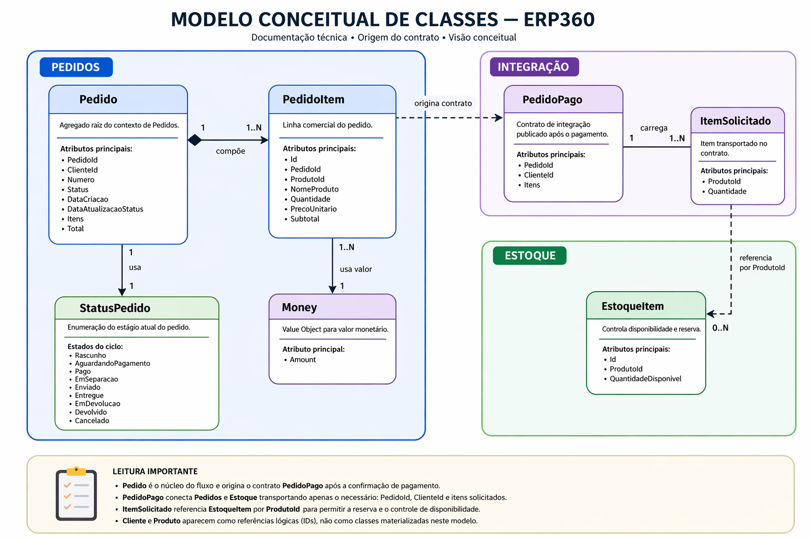
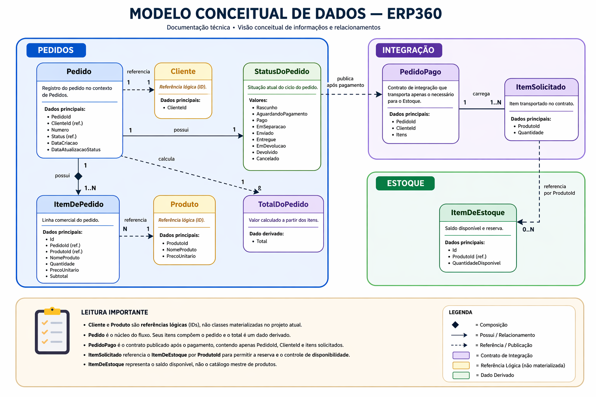

# 04. Modelagem Conceitual

## Artefatos visuais desta seção

### Modelo Conceitual de Classes

### Modelo Conceitual de Dados

## 4.1 Objetivo desta seção

Esta seção consolida a modelagem conceitual do ERP360 no estado atual do projeto. Seu papel é explicar, em nível semântico e estrutural:

- quais são as principais classes e objetos do domínio

- quais dados esses elementos representam

- como eles se relacionam

- qual responsabilidade cada um possui

- como o modelo parte de Pedidos e se expande para Estoque

Esta seção ainda não trata de tabela, coluna, tipo SQL ou migration. Essas definições pertencem ao modelo físico e são aprofundadas depois.

## 4.2 Ponto de partida da modelagem

A modelagem conceitual do ERP360 parte do contexto de Pedidos.
É nesse módulo que o fluxo principal nasce, porque é ali que o sistema:

- registra a intenção comercial

- mantém itens

- controla o ciclo de vida do pedido

- produz o fato que aciona outro contexto

A partir desse núcleo, o modelo se expande para Estoque, que reage ao pagamento confirmado e executa a reserva dos produtos.

Essa ordem é importante porque o contexto de Estoque, no recorte atual do projeto, não existe como origem do fluxo. Ele aparece como contexto reagente.

## 4.3 MODELO CONCEITUAL DE CLASSES — MÓDULO DE PEDIDOS

### 4.3.1 Classe central: Pedido

**Papel no domínio**

Pedido é a entidade central do contexto de Pedidos e o agregado raiz do módulo.

**O que ela representa**

Ela representa o pedido como unidade de negócio, reunindo:

- identidade

- vínculo com o cliente

- itens

- status atual

- datas relevantes do ciclo

- eventos produzidos ao longo do processo

**Responsabilidades principais**

- manter a identidade do pedido

- manter a coleção de itens

- controlar o status atual

- calcular o valor total a partir dos itens

- validar mudanças relevantes do ciclo do pedido

- registrar eventos de domínio quando fatos importantes acontecem

**Atributos conceituais principais**

- PedidoId

- ClienteId

- Numero

- Status

- DataCriacao

- DataAtualizacaoStatus

- Itens

- Events

- Total como valor derivado

**Operações conceituais principais**

- criar rascunho

- adicionar item

- confirmar pedido

- marcar pago

- iniciar separação

- marcar enviado

- marcar entregue

- iniciar devolução

- concluir devolução

- cancelar manualmente

- alterar status operacional

**Leitura importante**

Pedido não é apenas um contêiner de dados. Ele é a autoridade do ciclo de vida do pedido dentro do domínio.

### 4.3.2 Classe interna do agregado: PedidoItem

**Papel no domínio**

PedidoItem representa cada linha comercial do pedido.

**O que ela representa**

Ela registra o produto solicitado dentro do contexto do pedido, preservando o retrato comercial daquele item no momento da operação.

**Responsabilidades principais**

- identificar o produto associado ao item

- registrar o nome comercial usado naquele pedido

- registrar a quantidade solicitada

- registrar o preço unitário aplicado

- permitir o cálculo do subtotal do item

**Atributos conceituais principais**

- Id

- PedidoId

- ProdutoId

- NomeProduto

- Quantidade

- PrecoUnitario

- Subtotal como valor derivado

**Leitura importante**

PedidoItem não é tratado como entidade independente do fluxo principal. Ele existe como parte da composição do agregado Pedido.

### 4.3.3 Enumeração conceitual: StatusPedido

**Papel no domínio**

StatusPedido representa o estágio atual do pedido no seu ciclo de vida.

**Estados identificados no projeto**

- Rascunho

- AguardandoPagamento

- Pago

- EmSeparacao

- Enviado

- Entregue

- EmDevolucao

- Devolvido

- Cancelado

**Responsabilidades principais**

- dar significado operacional ao momento atual do pedido

- orientar quais transições podem acontecer

- distinguir transições operacionais de transições especializadas

**Leitura importante**

O status pertence ao modelo conceitual do pedido, mas a matriz completa de transições e o comportamento detalhado do ciclo são aprofundados na seção comportamental.

### 4.3.4 Value Object: Money

**Papel no domínio**

Money encapsula valor monetário no contexto de Pedidos.

**Responsabilidades principais**

- representar valor monetário de forma consistente

- apoiar cálculo de preço unitário, subtotal e total

- evitar que valores monetários do pedido fiquem soltos sem semântica

**Atributo conceitual principal**

- Amount

**Operações conceituais principais**

- criar valor monetário

- somar valores

- multiplicar valor por quantidade

- representar valor monetário no domínio

**Leitura importante**

Money existe para dar mais clareza conceitual ao valor de pedido e item. No modelo físico, isso será convertido para um tipo persistível.

### 4.3.5 Estruturas de apoio do domínio

**DomainResult**

Representa o resultado de operações do domínio que podem ser aceitas ou recusadas conforme as regras de negócio.

**Papel principal**

- indicar sucesso

- indicar falha

- carregar a mensagem de recusa quando necessário

**IDomainEvent**

Representa um fato relevante ocorrido no domínio do pedido.

**Papel principal**

- marcar que algo relevante aconteceu

- permitir rastreamento semântico do ciclo do pedido

- separar fato de negócio de detalhes de infraestrutura

### 4.3.6 Eventos conceituais do módulo de Pedidos

**PedidoCriado**

Representa a criação formal do pedido já confirmado no fluxo inicial.

**Dados conceituais principais**

- PedidoId

- ClienteId

- Total

- instante da ocorrência

**StatusPedidoAlterado**

Representa a mudança de estado do pedido.

**Dados conceituais principais**

- PedidoId

- status anterior

- status de destino

- motivo

- data da mudança

- instante da ocorrência

**PedidoCancelado**

Representa o encerramento do pedido por cancelamento.

**Dados conceituais principais**

- PedidoId

- motivo

- instante da ocorrência

## 4.4 RELAÇÕES CONCEITUAIS — PEDIDOS

### 4.4.1 Pedido → PedidoItem

Relação de um para muitos.

Um pedido possui vários itens.
Cada item pertence a um único pedido no recorte atual do sistema.

**Leitura importante**

Essa é uma relação de composição no domínio: o item existe como parte do agregado.

### 4.4.2 Pedido → StatusPedido

Relação de uso de enumeração.

O pedido mantém um único status atual, que expressa sua posição no ciclo de vida.

### 4.4.3 PedidoItem → Money

Relação de uso de value object.

Cada item usa Money para representar o preço unitário.

### 4.4.4 Pedido → Money

Relação derivada.

O total do pedido resulta da composição dos valores dos seus itens.

### 4.4.5 Pedido → eventos de domínio

Relação de emissão e registro.

O pedido produz eventos quando fatos importantes do seu ciclo acontecem.

## 4.5 RESPONSABILIDADES CENTRAIS DO AGREGADO PEDIDO

Para a documentação ficar operacional, vale isolar as responsabilidades mais importantes do agregado.

**Responsabilidade 1 — Identidade**

Manter a identidade do pedido e seu número funcional.

**Responsabilidade 2 — Composição**

Manter a coleção de itens que representam a operação comercial.

**Responsabilidade 3 — Valor**

Permitir o cálculo do total a partir dos itens.

**Responsabilidade 4 — Ciclo de vida**

Controlar o status atual e a evolução do pedido ao longo do processo.

**Responsabilidade 5 — Reação a ações de negócio**

Responder a ações como confirmação, pagamento, envio, devolução e cancelamento.

**Responsabilidade 6 — Registro de fatos relevantes**

Registrar eventos de domínio associados a mudanças importantes.

## 4.6 LEITURA CONCEITUAL DO CICLO DO PEDIDO

No nível conceitual, o pedido segue um ciclo composto por estados de negócio.

**Linha principal do ciclo**

**Rascunho
→ AguardandoPagamento
→ Pago
→ EmSeparacao
→ Enviado
→ Entregue**

**Caminho de devolução previsto**

**Entregue
→ EmDevolucao
→ Devolvido**

**Caminhos de cancelamento previstos no modelo atual**

- Rascunho → Cancelado

- AguardandoPagamento → Cancelado

- Pago → Cancelado

**Leitura importante**

A transição para Pago faz parte do ciclo do pedido, mas ela não pertence ao fluxo genérico de alteração de status. Conceitualmente, ela depende da operação especializada de confirmação de pagamento.

**Observação**

A matriz detalhada de transições, recusas e ações associadas é aprofundada na seção comportamental. Aqui o objetivo é apenas registrar a estrutura do ciclo, e não exaurir seu comportamento.

## 4.7 MODELO CONCEITUAL DE DADOS — MÓDULO DE PEDIDOS

### 4.7.1 Conceitos de dados principais

**Conceito de dado: Pedido**

Representa a unidade central do processo comercial.

**Dados centrais associados**

- identificador do pedido

- identificador do cliente

- número funcional

- status atual

- data de criação

- data da última atualização de status

**Conceito de dado: Item de Pedido**

Representa cada produto solicitado dentro de um pedido.

**Dados centrais associados**

- identificador do item

- vínculo com o pedido

- identificador do produto

- nome do produto

- quantidade

- preço unitário

- subtotal derivado

**Conceito de dado: Cliente**

No escopo atual, Cliente aparece conceitualmente como referência por ClienteId.

**Leitura importante**

O módulo reconhece a existência de um cliente, mas não possui, neste estágio, uma entidade Cliente materializada dentro do seu núcleo implementado.

**Conceito de dado: Produto**

Produto aparece no módulo de Pedidos por meio das informações armazenadas no item:

- ProdutoId

- NomeProduto

- PrecoUnitario

**Leitura importante**

O item preserva uma visão comercial do produto no momento da operação. Isso é suficiente para o recorte atual do sistema.

**Conceito de dado: Status do Pedido**

Status é um dado estruturante do processo. Ele participa tanto da leitura operacional quanto das decisões do domínio.

**Conceito de dado: Total do Pedido**

O total é um dado derivado, calculado a partir dos itens.

**Conceito de dado: Evento de Domínio**

Os eventos representam fatos relevantes do ciclo do pedido. No modelo conceitual, eles existem como informação semântica do processo.

### 4.7.2 Relações conceituais de dados — Pedidos

**Pedido possui Itens de Pedido**

Um pedido contém vários itens.

**Item de Pedido referencia Produto**

Cada item aponta para um produto por identificador.

**Pedido referencia Cliente**

Cada pedido aponta para um cliente por identificador.

**Pedido possui Status**

Cada pedido tem exatamente um status atual.

**Pedido produz Eventos**

Mudanças relevantes do pedido podem produzir fatos do domínio associados ao seu ciclo.

## 4.8 EXPANSÃO CONCEITUAL PARA O MÓDULO DE ESTOQUE

### 4.8.1 Papel do módulo de Estoque

Depois que o fluxo nasce em Pedidos, ele se expande para Estoque por meio do fato de negócio associado ao pagamento confirmado.

O contexto de Estoque não aparece como prolongamento interno do pedido. Ele possui sua própria responsabilidade: controlar disponibilidade e executar reserva.

### 4.8.2 Classe central: EstoqueItem

**Papel no domínio**

EstoqueItem representa a disponibilidade de um produto no contexto de Estoque.

**Responsabilidades principais**

- identificar o produto controlado

- manter a quantidade disponível

- informar se a reserva é possível

- efetivar a redução de saldo quando a reserva é aceita

**Atributos conceituais principais**

- Id

- ProdutoId

- QuantidadeDisponivel

**Operações conceituais principais**

- verificar possibilidade de reserva

- reservar quantidade

**Leitura importante**

O modelo de Estoque é mais enxuto do que o de Pedidos, o que é coerente com o recorte atual do projeto.

### 4.8.3 Modelo conceitual de dados — Estoque

**Conceito de dado: Item de Estoque**

Representa o controle de disponibilidade de um produto.

**Dados centrais associados**

- identificador interno do item

- identificador do produto

- quantidade disponível

**Relação conceitual principal**

Cada item de estoque corresponde ao controle de um produto dentro do contexto de Estoque.

## 4.9 CONTRATOS CONCEITUAIS DE INTEGRAÇÃO

A ligação conceitual entre Pedidos e Estoque não é feita por relação direta de classe ou por acoplamento interno entre os módulos. Ela acontece por contrato de integração.

### 4.9.1 PedidoPago

**Papel na solução**

PedidoPago representa o fato de integração que sai do contexto de Pedidos e alcança o contexto de Estoque exclusivamente após a conclusão bem-sucedida do caso de uso de confirmação de pagamento.

**Dados conceituais principais**

- PedidoId

- ClienteId

- coleção de itens solicitados

### 4.9.2 ItemSolicitado

**Papel na solução**

ItemSolicitado representa cada produto e quantidade que o módulo de Estoque precisa considerar para a reserva.

**Dados conceituais principais**

- ProdutoId

- Quantidade

### 4.9.3 Leitura conceitual da conexão entre os módulos

A relação entre Pedido e EstoqueItem é indireta e mediada por evento.

**Sequência conceitual**

- o caso de uso ConfirmarPagamento é concluído com sucesso

- o pedido passa para Pago

- o contexto de Pedidos publica PedidoPago

- o contexto de Estoque lê os itens solicitados

- o estoque localiza seus próprios EstoqueItem

- cada item de estoque decide se pode reservar a quantidade recebida

- o estoque atualiza sua disponibilidade

**Leitura importante**

O ProdutoId funciona como ponto de correspondência lógica entre os dois contextos:

- em Pedidos, ele aparece no PedidoItem

- em Estoque, ele aparece no EstoqueItem

## 4.10 REPRESENTAÇÃO TEXTUAL CONSOLIDADA DO MODELO DE CLASSES

**Módulo de Pedidos**

**Pedido**

- PedidoId

- ClienteId

- Numero

- Status

- DataCriacao

- DataAtualizacaoStatus

- Itens

- Events

- Total

**Pedido**

- compõe vários PedidoItem

- usa StatusPedido

- calcula total com base em Money

- emite PedidoCriado

- emite StatusPedidoAlterado

- emite PedidoCancelado

- usa MarcarPago() como operação especializada para atingir Pago

- não deve usar alteração genérica de status para marcar pagamento

**PedidoItem**

- Id

- PedidoId

- ProdutoId

- NomeProduto

- Quantidade

- PrecoUnitario

- Subtotal

**StatusPedido**

- Rascunho

- AguardandoPagamento

- Pago

- EmSeparacao

- Enviado

- Entregue

- EmDevolucao

- Devolvido

- Cancelado

**Money**

- Amount

**Módulo de Estoque**

**EstoqueItem**

- Id

- ProdutoId

- QuantidadeDisponivel

**EstoqueItem**

- verifica possibilidade de reserva

- reduz disponibilidade quando a reserva é aceita

**Integração entre módulos**

**PedidoPago**

- PedidoId

- ClienteId

- Itens

**ItemSolicitado**

- ProdutoId

- Quantidade

## 4.11 REFERÊNCIAS INTERNAS ÚTEIS

Para a formalização das regras que governam essas entidades e relações, ver Seção 02 — Requisitos do Sistema.

Para o detalhamento do comportamento do pedido, da matriz de estados e dos fluxos envolvidos, ver Seção 05 — Diagramas Comportamentais.

Para a leitura arquitetural da separação entre bounded contexts e contratos entre módulos, ver Seção 06 — Arquitetura da Solução.

Para o desdobramento físico dessas estruturas em tabelas, colunas e relacionamentos de banco, ver Seção 07 — Modelo Físico de Dados.

## 4.12 Fechamento da seção

A modelagem conceitual atual do ERP360 mostra um núcleo de domínio centrado em Pedido, com expansão controlada para o contexto de Estoque por meio de contrato de integração.

No módulo de Pedidos, o agregado reúne:

- identidade

- itens

- valor

- status

- eventos relevantes do ciclo

No módulo de Estoque, o modelo se mantém mais enxuto:

- produto

- disponibilidade

- reserva

A ligação entre os módulos não acontece por acoplamento direto de classe nem por relacionamento físico no banco, mas por evento de integração, o que preserva a separação entre contextos e prepara a solução para evolução futura.

---

[Voltar ao índice](./README.md)
