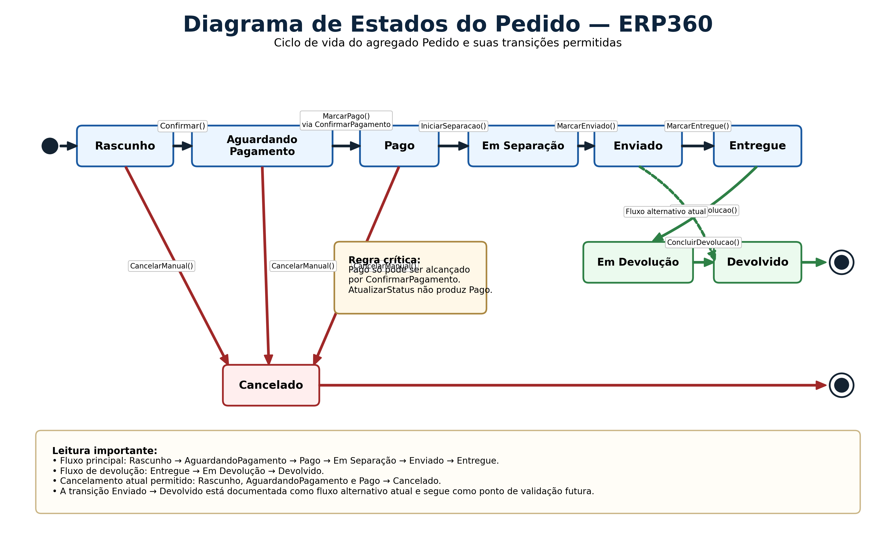
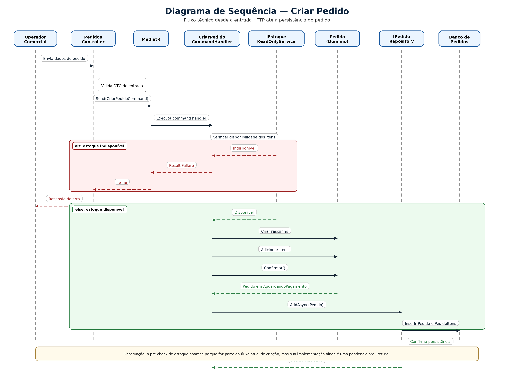
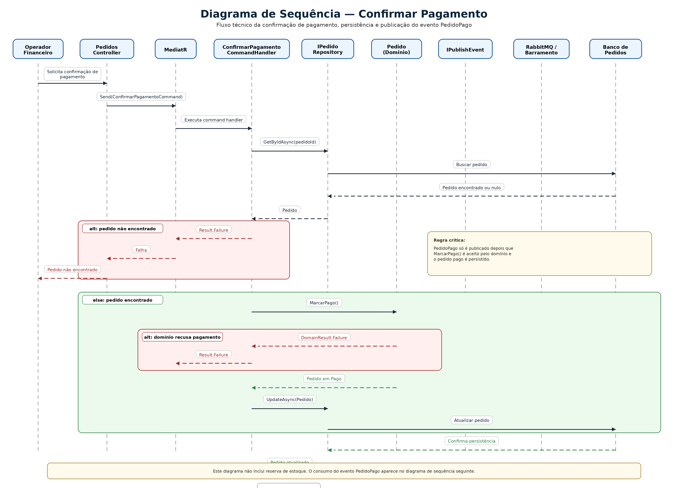
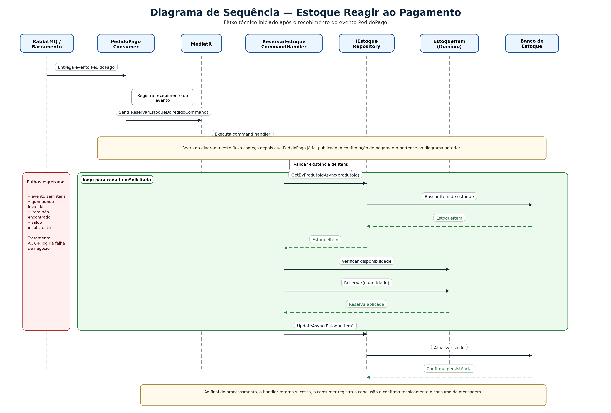
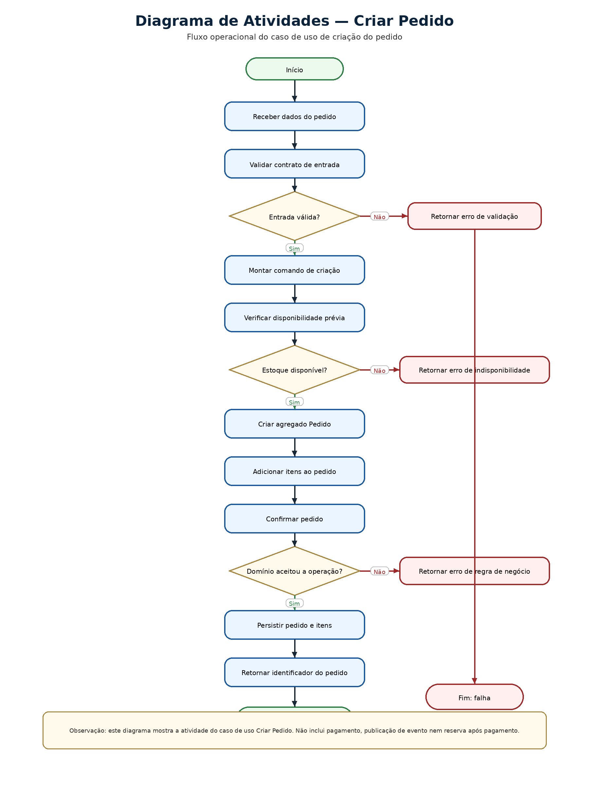
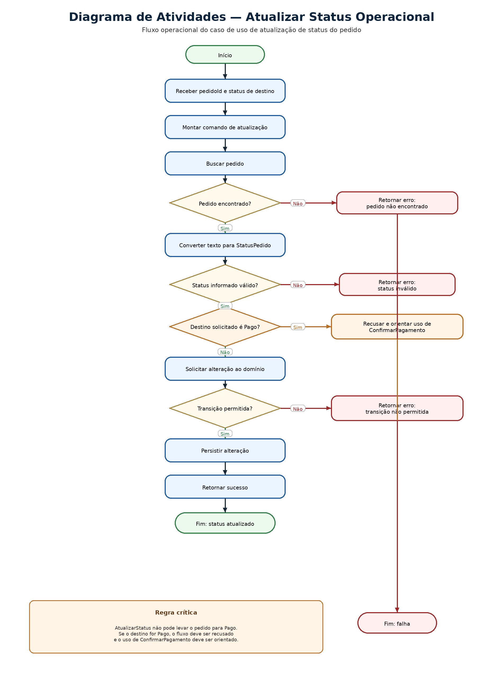
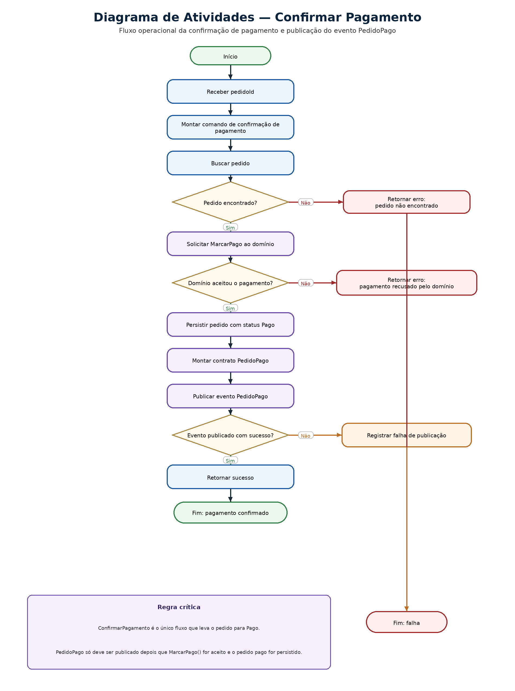
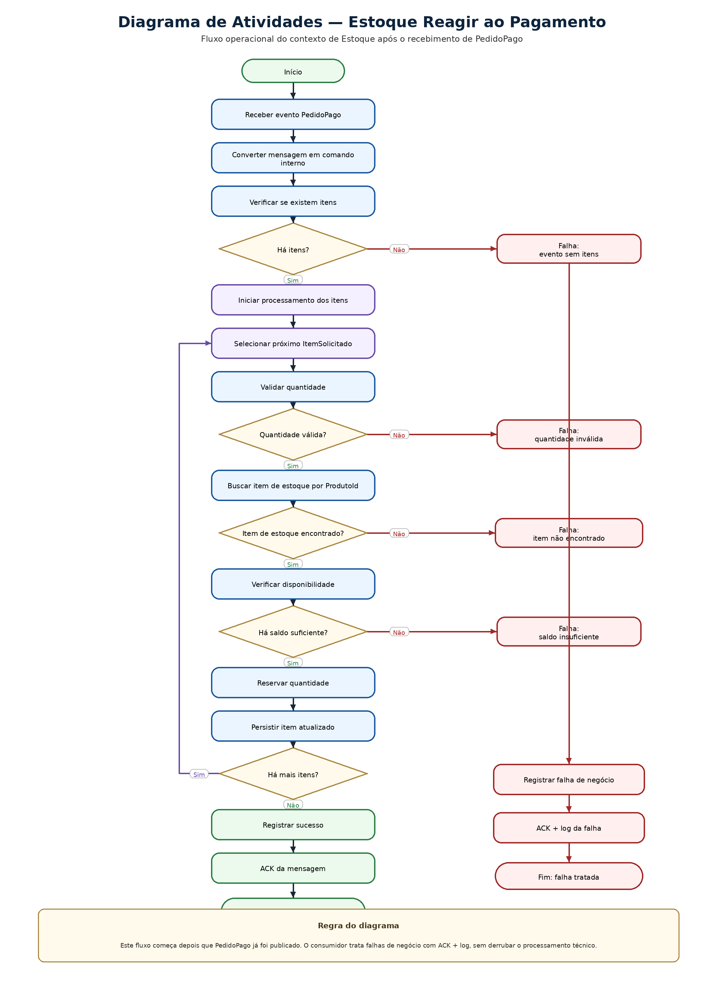

# 05. Diagramas Comportamentais

## Artefatos visuais desta seção

### Diagrama de Estados do Pedido

### Diagrama de Sequência — Criar Pedido

### Diagrama de Sequência — Confirmar Pagamento

### Diagrama de Sequência — Estoque Reagir ao Pagamento

### Diagrama de Atividades — Criar Pedido

### Diagrama de Atividades — Atualizar Status Operacional

### Diagrama de Atividades — Confirmar Pagamento

### Diagrama de Atividades — Estoque Reagir ao Pagamento

## 5.1 Objetivo desta seção

Esta seção consolida o comportamento do ERP360 em formato textual, servindo como base para os diagramas visuais que serão produzidos depois.

O foco aqui é descrever três perspectivas complementares do sistema:

- sequência, para mostrar quem interage com quem em cada fluxo

- estados, para mostrar a evolução do Pedido ao longo do seu ciclo

- atividades, para mostrar a trilha operacional dos casos principais

Esta seção parte do comportamento já implementado no projeto e também incorpora a decisão documental já consolidada de que:

- ConfirmarPagamento é o único caminho oficial para levar o pedido a Pago

- AtualizarStatus trata apenas estados operacionais

- PedidoPago nasce exclusivamente da confirmação de pagamento

## 5.2 DIAGRAMA DE SEQUÊNCIA — FLUXOS PRINCIPAIS

### 5.2.1 Fluxo: Criar pedido

**Participantes**

- Operador Comercial / Atendimento

- PedidosController

- MediatR

- CriarPedidoCommandHandler

- IEstoqueReadOnlyService

- Domínio Pedido

- IPedidoRepository

- Banco de Pedidos

**Sequência textual**

- O operador envia a requisição de criação de pedido.

- O PedidosController recebe o DTO de entrada.

- O controller converte a entrada em CriarPedidoCommand.

- O command é enviado ao MediatR.

- O MediatR encaminha a execução para CriarPedidoCommandHandler.

- O handler transforma os itens recebidos em estrutura de apoio para validação prévia.

- O handler consulta IEstoqueReadOnlyService para verificar disponibilidade.

- Se não houver disponibilidade, o fluxo é encerrado com falha.

- Se houver disponibilidade, o handler cria o agregado Pedido em estado Rascunho.

- O handler adiciona os itens ao pedido.

- O handler chama pedido.Confirmar().

- O domínio valida a transição inicial do pedido.

- Se a operação for aceita, o pedido passa para AguardandoPagamento.

- O domínio registra as informações do ciclo e adiciona PedidoCriado.

- O handler persiste o pedido via IPedidoRepository.AddAsync.

- O repositório grava o agregado no banco.

- O handler devolve sucesso com o identificador do pedido.

- O controller responde com sucesso.

**Resultado do fluxo**

- pedido criado

- itens registrados

- status em AguardandoPagamento

- evento de domínio PedidoCriado registrado

**Caminhos alternativos relevantes**

- indisponibilidade detectada no pré-check

- falha de regra no domínio

- falha de persistência

### 5.2.2 Fluxo: Consultar pedido

**Participantes**

- Operador Comercial / Atendimento

- PedidosController

- MediatR

- ObterPedidoPorIdQueryHandler

- IPedidoRepository

- Banco de Pedidos

**Sequência textual**

- O operador solicita a consulta de um pedido por identificador.

- O PedidosController recebe o id.

- O controller monta ObterPedidoPorIdQuery.

- A query é enviada ao MediatR.

- O MediatR encaminha para ObterPedidoPorIdQueryHandler.

- O handler busca o pedido via IPedidoRepository.GetByIdAsync.

- O repositório consulta o banco.

- Se o pedido não existir, o fluxo retorna falha.

- Se existir, o handler converte o agregado em modelo de leitura.

- O handler calcula os valores derivados necessários para retorno.

- O handler devolve sucesso com o resultado da consulta.

- O controller responde com o DTO de saída.

**Resultado do fluxo**

- dados do pedido retornados para leitura

**Caminho alternativo relevante**

- pedido não encontrado

### 5.2.3 Fluxo: Atualizar status operacional do pedido

**Participantes**

- Ator de processo / sistema chamador

- PedidosController

- MediatR

- AtualizarStatusPedidoCommandHandler

- IPedidoRepository

- Domínio Pedido

- Banco de Pedidos

**Sequência textual**

- O ator solicita a atualização de status de um pedido.

- O PedidosController recebe o identificador do pedido e o status desejado.

- O controller monta AtualizarStatusPedidoCommand.

- O command é enviado ao MediatR.

- O MediatR encaminha para AtualizarStatusPedidoCommandHandler.

- O handler busca o pedido no repositório.

- Se o pedido não existir, o fluxo encerra com falha.

- O handler converte o status informado para StatusPedido.

- Se o valor informado for inválido, o fluxo encerra com falha.

- Se o status solicitado for Pago, o fluxo deve ser recusado, orientando o uso de ConfirmarPagamento.

- Para um status operacional válido, o handler chama pedido.AlterarStatus(destino).

- O domínio verifica se a transição é permitida.

- Se a transição for recusada, o fluxo encerra com falha.

- Se a transição for aceita, o pedido atualiza seu status e registra StatusPedidoAlterado.

- Se o destino for Cancelado, o domínio também registra PedidoCancelado.

- O handler persiste a alteração via IPedidoRepository.UpdateAsync.

- O repositório grava o novo estado no banco.

- O handler devolve sucesso.

- O controller responde com sucesso.

**Resultado do fluxo**

- status operacional atualizado

- alteração persistida

- nenhum evento de integração publicado por este caso de uso

**Caminhos alternativos relevantes**

- pedido inexistente

- status inválido

- tentativa de marcar Pago por fluxo inadequado

- transição recusada pelo domínio

- falha de persistência

### 5.2.4 Fluxo: Confirmar pagamento

**Participantes**

- Operador Financeiro

- PedidosController

- MediatR

- ConfirmarPagamentoCommandHandler

- IPedidoRepository

- Domínio Pedido

- IPublishEvent

- RabbitMQ / barramento

- Banco de Pedidos

**Sequência textual**

- O operador financeiro solicita a confirmação de pagamento.

- O PedidosController recebe o pedidoId.

- O controller monta ConfirmarPagamentoCommand.

- O command é enviado ao MediatR.

- O MediatR encaminha para ConfirmarPagamentoCommandHandler.

- O handler busca o pedido via repositório.

- Se o pedido não existir, o fluxo encerra com falha.

- O handler chama pedido.MarcarPago().

- O domínio valida se a transição para Pago é permitida.

- Se a transição for recusada, o fluxo encerra com falha.

- Se for aceita, o pedido passa para Pago, registra atualização de status e produz StatusPedidoAlterado.

- O handler persiste a alteração no banco.

- O handler lê os itens do pedido.

- O handler monta o contrato PedidoPago.

- O handler publica o evento via IPublishEvent.

- O barramento recebe a mensagem.

- O handler devolve sucesso.

- O controller responde com sucesso.

**Resultado do fluxo**

- pedido em Pago

- alteração persistida

- evento PedidoPago publicado

**Caminhos alternativos relevantes**

- pedido inexistente

- estado atual incompatível com pagamento

- falha de persistência

- falha de publicação

**Observação importante**

Este é o único fluxo oficial que leva o pedido para Pago e inicia a integração com Estoque.

### 5.2.5 Fluxo: Publicar PedidoPago

**Participantes**

- ConfirmarPagamentoCommandHandler

- Contrato PedidoPago

- IPublishEvent

- RabbitMQ / barramento

**Sequência textual**

- O caso de uso ConfirmarPagamento é concluído com sucesso.

- O handler lê os itens do pedido.

- Cada item é convertido em ItemSolicitado.

- O handler monta o contrato PedidoPago.

- O handler chama IPublishEvent.PublishAsync.

- A implementação do barramento envia a mensagem para o RabbitMQ.

- O evento fica disponível para consumo no contexto de Estoque.

**Resultado do fluxo**

- fato de integração publicado para outro contexto

**Observação importante**

A publicação de PedidoPago não pertence ao fluxo genérico de atualização de status.

### 5.2.6 Fluxo: Estoque reagir ao pagamento

**Participantes**

- RabbitMQ / barramento

- PedidoPagoConsumer

- MediatR

- ReservarEstoqueDoPedidoCommandHandler

- IEstoqueRepository

- Domínio EstoqueItem

- Banco de Estoque

**Sequência textual**

- O RabbitMQ entrega o evento PedidoPago ao consumer.

- O PedidoPagoConsumer registra o recebimento do evento.

- O consumer converte a mensagem em comando interno de reserva.

- O command é enviado ao MediatR.

- O MediatR encaminha para ReservarEstoqueDoPedidoCommandHandler.

- O handler valida se a requisição possui itens.

- Se não houver itens, o fluxo encerra com falha.

- Para cada item recebido, o handler valida a quantidade.

- O handler busca o EstoqueItem correspondente por ProdutoId.

- Se o item não existir, o fluxo encerra com falha.

- O handler verifica se há disponibilidade suficiente.

- Se não houver saldo, o fluxo encerra com falha.

- Se houver disponibilidade, o handler chama Reservar(quantidade).

- O domínio reduz a quantidade disponível.

- O handler persiste a alteração no repositório.

- O processo se repete para os demais itens.

- Ao final, o handler devolve sucesso.

- O consumer registra a conclusão do processamento.

**Resultado do fluxo**

- saldo reservado no contexto de Estoque

- alterações persistidas no banco de Estoque

**Caminhos alternativos relevantes**

- evento sem itens

- quantidade inválida

- item de estoque inexistente

- saldo insuficiente

- falha de persistência

## 5.3 DIAGRAMA DE ESTADOS DO PEDIDO — FORMATO TEXTUAL

### 5.3.1 Objetivo

O diagrama de estados do Pedido descreve como o agregado evolui ao longo do seu ciclo de vida.

O foco aqui é mostrar:

- estados existentes

- transições permitidas

- estados de encerramento

- relação entre mudança de estado e comportamento do domínio

### 5.3.2 Estado inicial

**Estado inicial do agregado**

**Rascunho**

O pedido nasce em Rascunho no momento de sua criação.

### 5.3.3 Estados identificados no ciclo atual

- Rascunho

- AguardandoPagamento

- Pago

- EmSeparacao

- Enviado

- Entregue

- EmDevolucao

- Devolvido

- Cancelado

### 5.3.4 Transições permitidas

**Fluxo principal**

- Rascunho → AguardandoPagamento

- AguardandoPagamento → Pago

- Pago → EmSeparacao

- EmSeparacao → Enviado

- Enviado → Entregue

- Entregue → EmDevolucao

- EmDevolucao → Devolvido

**Fluxo alternativo presente no modelo atual**

- Enviado → Devolvido

**Fluxos de cancelamento permitidos**

- Rascunho → Cancelado

- AguardandoPagamento → Cancelado

- Pago → Cancelado

### 5.3.5 Transições bloqueadas por regra

O domínio deve recusar qualquer transição que não pertença à matriz permitida do pedido.

Exemplos de transições bloqueadas:

- Rascunho → Pago

- Rascunho → Enviado

- AguardandoPagamento → Entregue

- Pago → Entregue

- Entregue → Cancelado

- Devolvido → Pago

- Cancelado → qualquer outro estado

**Observação importante**

Além da matriz de estados, o sistema também deve recusar o uso do fluxo genérico de atualização de status para alcançar Pago, mesmo que a transição AguardandoPagamento → Pago exista no ciclo do pedido.

### 5.3.6 Ações associadas às transições

**Rascunho → AguardandoPagamento**

Ação associada:

- Confirmar()

**AguardandoPagamento → Pago**

Ação associada:

- MarcarPago()

Observação do fluxo:
No nível de caso de uso, essa transição é acionada exclusivamente por ConfirmarPagamento.

**Pago → EmSeparacao**

Ação associada:

- IniciarSeparacao()

**EmSeparacao → Enviado**

Ação associada:

- MarcarEnviado()

**Enviado → Entregue**

Ação associada:

- MarcarEntregue()

**Entregue → EmDevolucao**

Ação associada:

- IniciarDevolucao()

**EmDevolucao → Devolvido**

Ação associada:

- ConcluirDevolucao()

**Rascunho / AguardandoPagamento / Pago → Cancelado**

Ações associadas:

- CancelarManual()

- ou AlterarStatus(Cancelado)

### 5.3.7 Estados de encerramento

**Cancelado**

Representa encerramento por cancelamento.
No modelo atual, não possui transição de saída.

**Devolvido**

Representa encerramento do fluxo de devolução.
No modelo atual, também não possui transição de saída.

**Entregue**

Embora represente a conclusão do fluxo principal, ainda pode evoluir para devolução.

### 5.3.8 Reações do domínio a uma mudança válida de estado

Quando uma transição válida acontece, o agregado:

- guarda o status anterior

- atualiza o status atual

- atualiza DataAtualizacaoStatus

- registra StatusPedidoAlterado

- se o destino for Cancelado, registra também PedidoCancelado

## 5.4 DIAGRAMA DE ATIVIDADES — CASOS PRINCIPAIS

### 5.4.1 Atividade: Criar pedido

**Fluxo textual de atividade**

- Início

- Receber dados do pedido

- Validar contrato de entrada

- Montar comando de criação

- Verificar disponibilidade prévia

- Estoque disponível?

  - Não → encerrar com falha

  - Sim → continuar

- Criar agregado Pedido

- Adicionar itens

- Confirmar pedido

- Operação aceita pelo domínio?

- Não → encerrar com falha

- Sim → continuar

- Persistir pedido

- Retornar identificador

- Fim

### 5.4.2 Atividade: Consultar pedido

**Fluxo textual de atividade**

- Início

- Receber identificador do pedido

- Montar query

- Buscar pedido no repositório

- Pedido encontrado?

  - Não → retornar falha

  - Sim → continuar

- Montar modelo de leitura

- Converter para DTO de saída

- Retornar sucesso

- Fim

### 5.4.3 Atividade: Atualizar status operacional

**Fluxo textual de atividade**

- Início

- Receber pedido e status de destino

- Montar comando

- Buscar pedido

- Pedido encontrado?

  - Não → encerrar com falha

  - Sim → continuar

- Converter texto para StatusPedido

- Status informado válido?

  - Não → encerrar com falha

  - Sim → continuar

- Destino solicitado é Pago?

  - Sim → recusar e orientar uso de ConfirmarPagamento

  - Não → continuar

- Solicitar alteração ao domínio

- Transição permitida?

- Não → encerrar com falha

- Sim → continuar

- Persistir alteração

- Retornar sucesso

- Fim

### 5.4.4 Atividade: Confirmar pagamento

**Fluxo textual de atividade**

- Início

- Receber pedidoId

- Montar comando de confirmação de pagamento

- Buscar pedido

- Pedido encontrado?

  - Não → encerrar com falha

  - Sim → continuar

- Solicitar MarcarPago() ao domínio

- Transição aceita?

  - Não → encerrar com falha

  - Sim → continuar

- Persistir pedido atualizado

- Montar contrato PedidoPago

- Publicar evento

- Retornar sucesso

- Fim

Observação da atividade:
Este é o único fluxo que leva o pedido para Pago e inicia a integração com Estoque.

### 5.4.5 Atividade: Publicar PedidoPago

**Fluxo textual de atividade**

- Início

- Pagamento confirmado com sucesso

- Ler itens do pedido

- Transformar itens em ItemSolicitado

- Montar contrato PedidoPago

- Enviar mensagem ao barramento

- Publicação concluída?

  - Não → registrar falha

  - Sim → seguir

- Fim

### 5.4.6 Atividade: Estoque reagir ao pagamento

**Fluxo textual de atividade**

- Início

- Receber evento PedidoPago

- Converter mensagem em comando interno

- Verificar se existem itens

- Há itens?

  - Não → registrar falha e encerrar

  - Sim → continuar

- Para cada item recebido:

  - validar quantidade

  - buscar item de estoque por produto

  - item encontrado?

    - Não → registrar falha e encerrar

    - Sim → continuar

  - há disponibilidade suficiente?

    - Não → registrar falha e encerrar

    - Sim → continuar

  - reservar quantidade

  - persistir item atualizado

- Todos os itens processados?

  - Não → continuar o loop

  - Sim → concluir

- Registrar sucesso

- Fim

## 5.5 OBSERVAÇÕES IMPORTANTES

### 5.5.1 Esta seção serve de base operacional

Entre as seções da documentação, este é um dos que mais se aproxima da leitura prática do código. Por isso, a revisão aqui foi mais conservadora: o objetivo não é deixar o texto “bonito”, e sim mantê-lo útil para implementação, revisão e posterior desenho dos diagramas.

### 5.5.2 A matriz de estados ainda contém decisões que precisam ser confirmadas

Esta seção registra o comportamento atualmente identificado no projeto e na documentação, mas algumas transições ainda aparecem como pendência de validação final do domínio, especialmente:

- Enviado → Devolvido

- cancelamento após Pago

Esses pontos devem continuar amarrados ao apanhado consolidado de pendências.

## 5.6 REFERÊNCIAS INTERNAS ÚTEIS

Para a formalização das regras que governam esses fluxos, ver Seção 02 — Requisitos do Sistema.

Para o significado conceitual das entidades e estados envolvidos, ver Seção 04 — Modelagem Conceitual.

Para a estrutura arquitetural que sustenta esses fluxos entre API, aplicação, domínio, persistência e mensageria, ver Seção 06 — Arquitetura da Solução.

Para a sequência histórica das decisões que endureceram o tratamento do pagamento e da integração, ver Seção 10 — Histórico de Evolução e Decisões Importantes.

## 5.7 Fechamento da seção

Esta seção consolida o comportamento do ERP360 em três níveis complementares:

- sequência, mostrando a interação entre participantes do fluxo

- estados, mostrando a evolução do pedido no domínio

- atividades, mostrando a trilha operacional dos casos principais

No estado atual da documentação, ele também fixa uma decisão central do sistema: a confirmação de pagamento possui fluxo próprio, leva o pedido a Pago e inicia de forma exclusiva a integração com Estoque.

---

[Voltar ao índice](./README.md)
