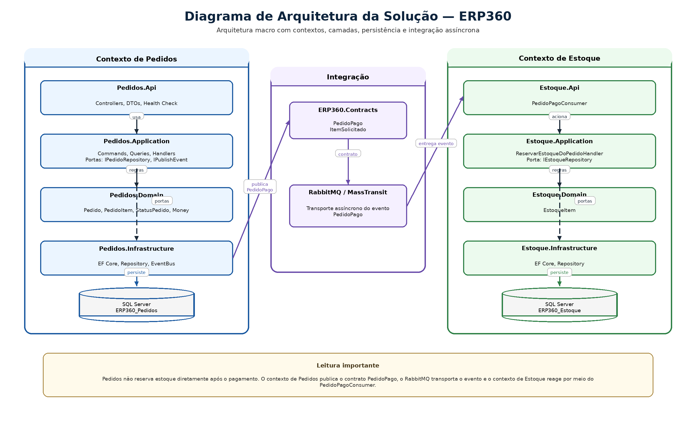

# 06. Arquitetura da Solução

## Artefatos visuais desta seção

### Diagrama de Arquitetura da Solução

## 6.1 Objetivo desta seção

Esta seção descreve a arquitetura do ERP360 no estado atual do projeto. Seu papel é apresentar:

- a arquitetura geral da solução

- os módulos e bounded contexts implementados

- as camadas do sistema

- os contratos entre módulos

- as responsabilidades de cada camada

- as principais decisões arquiteturais já adotadas

Esta seção trata da estrutura técnica da solução, e não do inventário detalhado de classes ou do modelo físico de dados. Esses aprofundamentos aparecem em seções próprias.

## 6.2 Visão arquitetural geral

O ERP360 está organizado como uma solução modular em .NET 8, estruturada por contextos de negócio e por camadas técnicas.

No estado atual, o fluxo principal parte do contexto de Pedidos e alcança o contexto de Estoque após a confirmação de pagamento. Esse desenho já está materializado no projeto por meio de:

- APIs separadas por contexto

- camadas Api, Application, Domain e Infrastructure

- persistência real com SQL Server

- integração assíncrona com RabbitMQ e MassTransit

- contratos compartilhados em projeto próprio

**Leitura arquitetural de alto nível**

A solução funciona, em termos estruturais, da seguinte forma:

- Pedidos recebe a intenção externa na API

- a Application executa o caso de uso

- o Domain valida as regras centrais do pedido

- a Infrastructure persiste e publica o evento quando necessário

- o evento é transportado pelo RabbitMQ

- Estoque consome o evento e executa a reserva no seu próprio contexto

Essa organização já permite que o ERP360 tenha:

- separação de responsabilidades

- menor acoplamento entre fluxos

- base para evolução por novos módulos

## 6.3 Módulos e bounded contexts

### 6.3.1 Contexto de Pedidos

O bounded context de Pedidos concentra o núcleo funcional atual da solução.

**Responsabilidades centrais**

- criar pedidos

- manter itens do pedido

- consultar pedidos

- controlar o ciclo de status

- confirmar pagamento

- publicar o evento PedidoPago

**Projetos que materializam esse contexto**

- ERP360.Pedidos.Api

- ERP360.Pedidos.Application

- ERP360.Pedidos.Domain

- ERP360.Pedidos.Infrastructure

**Elementos já implementados**

- PedidosController

- commands e queries com MediatR

- agregado Pedido

- PedidoItem

- StatusPedido

- Money

- PedidosDbContext

- PedidoRepository

- RabbitMqEventBus

### 6.3.2 Contexto de Estoque

O bounded context de Estoque responde pelo controle de disponibilidade e pela reserva após o pagamento confirmado.

**Responsabilidades centrais**

- receber PedidoPago

- localizar itens de estoque

- validar disponibilidade

- reservar quantidades

- persistir o novo saldo

**Projetos que materializam esse contexto**

- ERP360.Estoque.Api

- ERP360.Estoque.Application

- ERP360.Estoque.Domain

- ERP360.Estoque.Infrastructure

**Elementos já implementados**

- PedidoPagoConsumer

- ReservarEstoqueDoPedidoCommandHandler

- EstoqueItem

- EstoqueDbContext

- EstoqueRepository

### 6.3.3 Contexto de contratos

O projeto ERP360.Contracts formaliza os contratos de integração entre os contextos.

**Papel arquitetural**

- centralizar mensagens compartilhadas

- evitar duplicidade entre publisher e consumer

- sustentar a comunicação entre módulos sem acoplamento direto de implementação

**Elementos já implementados**

- PedidoPago

- ItemSolicitado

### 6.3.4 Leitura consolidada dos contextos

No desenho atual da solução:

- Pedidos é o contexto de origem do fluxo principal

- Estoque é o contexto que reage ao pagamento

- Contracts é a fronteira formal da integração

**Observação importante**

O projeto já possui a abstração IEstoqueReadOnlyService no contexto de Pedidos, mas sua implementação atual ainda é um stub. Isso significa que a arquitetura já aponta para a direção correta da porta, mas esse ponto ainda não está totalmente amadurecido como integração real.

## 6.4 Camadas do sistema

Cada contexto principal da solução está organizado em quatro camadas:

- Api

- Application

- Domain

- Infrastructure

Essa estrutura já está presente fisicamente no repositório e não é apenas uma convenção conceitual.

### 6.4.1 Camada Api

**Papel**

A camada Api representa a borda de entrada e hospedagem do contexto.

**Responsabilidades no ERP360**

- expor endpoints HTTP

- receber DTOs

- transformar entrada em command/query

- acionar MediatR

- registrar middlewares e serviços de borda

- configurar DI

- hospedar consumers quando necessário

**Evidências no projeto**

No contexto de Pedidos:

- PedidosController

- Program.cs

- CorrelationIdMiddleware

- validators

- health check

No contexto de Estoque:

- Program.cs

- PedidoPagoConsumer

- configuração MassTransit

### 6.4.2 Camada Application

**Papel**

A camada Application executa os casos de uso da solução.

**Responsabilidades no ERP360**

- definir commands e queries

- implementar handlers

- chamar portas abstratas

- coordenar persistência

- montar contratos de integração

- devolver resultados padronizados

**Evidências no projeto**

No contexto de Pedidos:

- CriarPedidoCommandHandler

- ConfirmarPagamentoCommandHandler

- AtualizarStatusPedidoCommandHandler

- ObterPedidoPorIdQueryHandler

- IPedidoRepository

- IEstoqueReadOnlyService

- IPublishEvent

No contexto de Estoque:

- ReservarEstoqueDoPedidoCommandHandler

- IEstoqueRepository

**Observação importante**

A Application de Pedidos já está estruturada em torno de casos de uso explícitos.
Também é aqui que existe, hoje, um dos principais pontos pendentes do projeto: o handler de atualização de status ainda precisa ser alinhado com a decisão consolidada de que somente ConfirmarPagamento pode levar o pedido a Pago.

### 6.4.3 Camada Domain

**Papel**

A camada Domain concentra as regras centrais do negócio.

**Responsabilidades no ERP360**

- representar entidades do domínio

- definir enums e value objects

- proteger invariantes

- validar transições

- registrar eventos de domínio

**Evidências no projeto**

No contexto de Pedidos:

- Pedido

- PedidoItem

- StatusPedido

- Money

- DomainResult

- PedidoCriado

- StatusPedidoAlterado

- PedidoCancelado

No contexto de Estoque:

- EstoqueItem

**Papel concreto no fluxo**

- Pedido controla o ciclo do pedido

- EstoqueItem controla a reserva de saldo

### 6.4.4 Camada Infrastructure

**Papel**

A camada Infrastructure implementa os detalhes técnicos necessários para que a Application e o Domain operem.

**Responsabilidades no ERP360**

- persistência com EF Core

- repositórios concretos

- DbContexts

- mapeamentos

- mensageria

- integração com SQL Server e RabbitMQ

**Evidências no projeto**

No contexto de Pedidos:

- PedidosDbContext

- PedidoRepository

- RabbitMqEventBus

- configurações EF

- migrations

No contexto de Estoque:

- EstoqueDbContext

- EstoqueRepository

- EstoqueItemConfiguration

- migrations

## 6.5 Responsabilidades das camadas

Para efeito documental, as responsabilidades das camadas podem ser resumidas assim.

**Api**

Responsável por:

- receber requisições

- transformar entrada em caso de uso

- responder na borda HTTP

- registrar elementos de entrada e integração

Não deve concentrar:

- regra de domínio

- persistência

- decisão central de fluxo

**Application**

Responsável por:

- coordenar casos de uso

- acionar domínio

- chamar portas abstratas

- persistir e publicar quando necessário

Não deve concentrar:

- regra estrutural do domínio

- detalhe técnico de framework

- detalhe concreto de banco e broker

**Domain**

Responsável por:

- representar o negócio

- validar transições

- proteger invariantes

- registrar fatos relevantes do ciclo

Não deve depender de:

- EF Core

- RabbitMQ

- ASP.NET Core

**Infrastructure**

Responsável por:

- persistir dados

- publicar mensagens

- implementar contratos técnicos

- concretizar integrações externas

Não deve reimplementar:

- regra de negócio que já pertence ao domínio

- orquestração que já pertence à aplicação

## 6.6 Contratos entre módulos

No ERP360 atual, os contratos aparecem em dois níveis:

- contratos internos entre camadas

- contratos externos entre contextos

### 6.6.1 Contratos internos entre camadas

São as interfaces que a Application usa para se desacoplar da infraestrutura.

**Em Pedidos**

- IPedidoRepository

- IEstoqueReadOnlyService

- IPublishEvent

**Em Estoque**

- IEstoqueRepository

**Papel arquitetural**

Esses contratos permitem que a regra de aplicação seja escrita sem dependência direta de:

- EF Core

- MassTransit

- detalhes concretos de infraestrutura

### 6.6.2 Contrato externo entre contextos

O principal contrato externo implementado hoje é:

- PedidoPago

Composto por:

- PedidoId

- ClienteId

- IReadOnlyList<ItemSolicitado>

E cada ItemSolicitado contém:

- ProdutoId

- Quantidade

**Papel arquitetural**

Esse contrato é a fronteira formal entre:

- o contexto que confirma o pagamento

- o contexto que reage reservando estoque

## 6.7 Leitura arquitetural por fluxo

A arquitetura fica mais clara quando observada pelos fluxos principais já implementados.

**Criação de pedido**

Pedidos.Api
→ Pedidos.Application
→ Pedidos.Domain
→ Pedidos.Infrastructure
→ SQL Server

**Confirmação de pagamento**

Pedidos.Api
→ Pedidos.Application
→ Pedidos.Domain
→ Pedidos.Infrastructure
→ RabbitMQ

**Reação do estoque ao pagamento**

RabbitMQ
→ Estoque.Api (PedidoPagoConsumer)
→ Estoque.Application
→ Estoque.Domain
→ Estoque.Infrastructure
→ SQL Server

## 6.8 Principais decisões arquiteturais

### 6.8.1 Separação por bounded contexts

A solução foi separada em Pedidos e Estoque, cada um com sua própria API, Application, Domain e Infrastructure.

**Efeito prático**

- responsabilidades mais claras

- menor acoplamento

- melhor base para crescimento modular

### 6.8.2 Organização em camadas

A estrutura em Api, Application, Domain e Infrastructure foi adotada em ambos os contextos.

**Efeito prático**

- melhor leitura técnica

- melhor separação de responsabilidades

- base mais adequada para testes e evolução

### 6.8.3 Controllers como borda HTTP principal

A entrada HTTP foi consolidada com Controllers.

**Efeito prático**

- borda mais clara

- endpoints mais explícitos

- maior aderência ao padrão predominante em soluções ASP.NET Core

### 6.8.4 CQRS com MediatR

A Application foi estruturada com commands e queries encaminhados via MediatR.

**Efeito prático**

- casos de uso explícitos

- leitura e escrita separadas

- handlers especializados

### 6.8.5 Persistência real com EF Core e SQL Server

A solução passou a operar com banco relacional real.

**Efeito prático**

- estado persistido de fato

- migrations

- repositórios concretos

- aproximação maior de ambiente corporativo real

### 6.8.6 Integração assíncrona com RabbitMQ e MassTransit

A ligação entre pagamento e reserva foi estruturada por mensageria assíncrona.

**Efeito prático**

- menor acoplamento entre contextos

- comunicação por evento

- base para novos consumidores no futuro

### 6.8.7 Contratos compartilhados em projeto próprio

ERP360.Contracts concentra a definição das mensagens de integração.

**Efeito prático**

- redução de duplicidade

- padronização da comunicação

- fronteira mais estável entre contextos

### 6.8.8 Result pattern no fluxo normal

O sistema usa resultado controlado para falhas esperadas de negócio.

**Efeito prático**

- tratamento mais explícito de sucesso e falha

- menor dependência de exceção para fluxo normal

- testes mais claros nos handlers

### 6.8.9 Observabilidade básica na borda de Pedidos

O contexto de Pedidos já possui:

- correlation id

- health check

- logs e configuração inicial de rastreabilidade

**Efeito prático**

- melhor diagnóstico local

- base para evolução futura de observabilidade

## 6.9 Estado atual da arquitetura

### 6.9.1 O que já está consolidado

- separação entre Pedidos e Estoque

- organização por camadas

- Controllers na borda

- commands e queries com MediatR

- domínio com regras centrais

- persistência real com EF Core

- SQL Server

- RabbitMQ + MassTransit

- consumer de PedidoPago

- contratos compartilhados

- base inicial de testes e rastreabilidade

### 6.9.2 O que ainda está provisório ou pendente

- IEstoqueReadOnlyService ainda usa implementação provisória

- AtualizarStatusPedidoCommandHandler ainda precisa refletir integralmente a regra consolidada de pagamento

- a borda de Estoque ainda está menos amadurecida do que a de Pedidos em termos operacionais

- a infraestrutura Docker ainda não está consolidada como ambiente único de subida

## 6.10 Referências internas úteis

Para o significado funcional das regras que a arquitetura precisa respeitar, ver Seção 02 — Requisitos do Sistema.

Para a modelagem conceitual das entidades e contratos que sustentam esta arquitetura, ver Seção 04 — Modelagem Conceitual.

Para a estrutura concreta de projetos, pastas e componentes técnicos, ver Seção 09 — Modelo de Classes de Projeto e Implementação.

Para o histórico das decisões arquiteturais e mudanças de rota, ver Seção 10 — Histórico de Evolução e Decisões Importantes.

## 6.11 Fechamento da seção

A arquitetura atual do ERP360 já se sustenta como uma solução modular organizada por bounded contexts, camadas bem definidas e integração assíncrona entre módulos.

O contexto de Pedidos concentra o núcleo do fluxo.
O contexto de Estoque responde pela reserva após o pagamento.
A Application executa os casos de uso.
O Domain protege as regras centrais.
A Infrastructure materializa persistência e mensageria.
ERP360.Contracts formaliza a integração entre contextos.

Esse desenho já está implementado de forma concreta no projeto e serve como base para leitura do código, revisão técnica e evolução futura.

---

[Voltar ao índice](./README.md)
