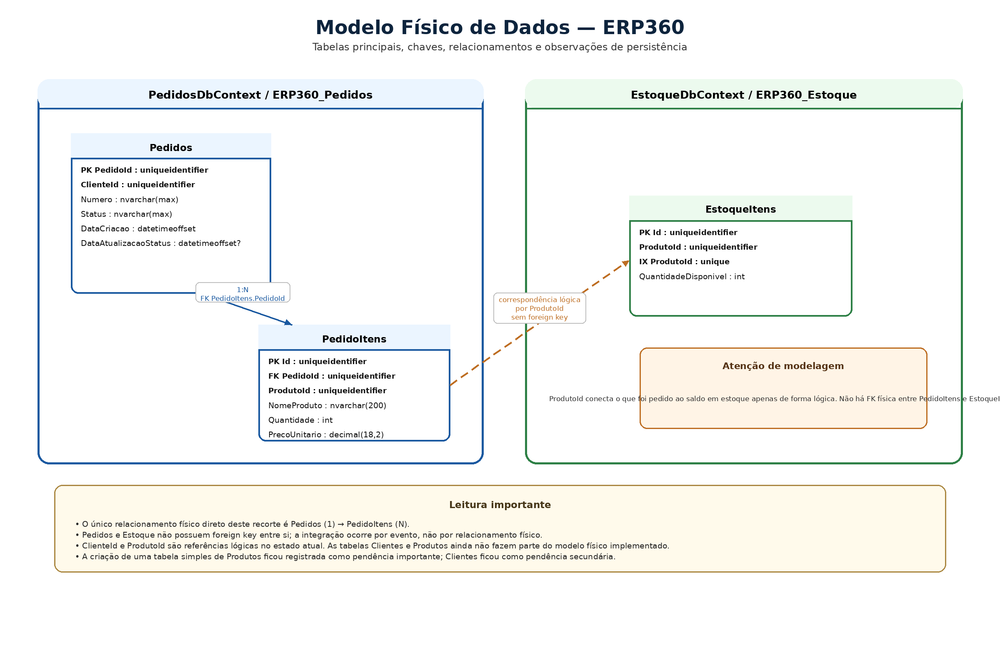

# 07. Modelo Físico de Dados

## Artefatos visuais desta seção

### Modelo Físico de Dados

## 7.1 Objetivo desta seção

Esta seção descreve o modelo físico de dados do ERP360 com base no que está implementado hoje na persistência relacional da solução.

O foco aqui é mostrar:

- tabelas principais

- colunas principais

- chaves e relacionamentos

- observações relevantes de persistência

- pontos em que o banco já reflete o domínio implementado

- pontos em que o modelo físico ainda pode ser endurecido

Neste estágio do projeto, os módulos com persistência real já materializada são:

- Pedidos

- Estoque

Ambos usam EF Core com SQL Server.

## 7.2 Visão física geral da persistência

Hoje o ERP360 possui dois contextos persistidos de forma separada.

**Contexto de Pedidos**

Persistido por meio do PedidosDbContext, com duas tabelas principais:

- Pedidos

- PedidoItens

**Contexto de Estoque**

Persistido por meio do EstoqueDbContext, com uma tabela principal:

- EstoqueItens

**Leitura importante**

No banco atual:

- Pedidos possui cabeçalho e itens

- Estoque possui itens controlados por produto

- a integração entre os módulos não acontece por relacionamento físico entre tabelas, mas por evento

Isso significa que Pedidos e Estoque não possuem foreign key entre si. A conexão entre os contextos acontece no nível da aplicação e da mensageria.

## 7.3 MODELO FÍSICO — MÓDULO DE PEDIDOS

### 7.3.1 Tabela Pedidos

**Finalidade**

Armazena o cabeçalho do pedido e os dados principais do seu ciclo de vida.

**Chave primária**

- PedidoId (uniqueidentifier) — PK

**Colunas principais**

| Coluna | Tipo SQL | Nulo? | Observação |
| --- | --- | --- | --- |
| PedidoId | uniqueidentifier | Não | Identificador do pedido |
| ClienteId | uniqueidentifier | Não | Referência lógica ao cliente |
| Numero | nvarchar(max) | Não | Número funcional do pedido |
| Status | nvarchar(max) | Não | Status persistido como texto |
| DataCriacao | datetimeoffset | Não | Data de criação do pedido |
| DataAtualizacaoStatus | datetimeoffset | Sim | Última atualização de status |

**Observações físicas importantes**

- PedidoId é um Guid, gerado na aplicação.

- Status é persistido como string por conversão explícita no EF Core.

- Numero existe fisicamente, mas ainda não possui índice nem restrição de unicidade.

- ClienteId é apenas uma referência lógica; não existe foreign key para tabela de clientes.

- DataAtualizacaoStatus é opcional no modelo atual.

### 7.3.2 Tabela PedidoItens

**Finalidade**

Armazena os itens pertencentes a cada pedido.

**Chave primária**

- Id (uniqueidentifier) — PK

**Chave estrangeira**

- PedidoId (uniqueidentifier) — FK para Pedidos(PedidoId)

**Colunas principais**

| Coluna | Tipo SQL | Nulo? | Observação |
| --- | --- | --- | --- |
| Id | uniqueidentifier | Não | Identificador do item |
| PedidoId | uniqueidentifier | Não | Relaciona item ao pedido |
| ProdutoId | uniqueidentifier | Não | Identificador lógico do produto |
| NomeProduto | nvarchar(200) | Não | Nome comercial do produto no pedido |
| Quantidade | int | Não | Quantidade pedida |
| PrecoUnitario | decimal(18,2) | Não | Valor persistido a partir de Money |

**Observações físicas importantes**

- PedidoItem possui identidade própria no banco, mesmo sendo parte do agregado.

- PrecoUnitario é armazenado como decimal(18,2) por conversão do value object Money.

- ProdutoId é armazenado apenas como referência lógica.

- NomeProduto é persistido no item para preservar o retrato comercial do produto no momento do pedido.

- Subtotal não é persistido como coluna; ele é derivado.

### 7.3.3 Relacionamento físico entre Pedidos e PedidoItens

**Tipo de relacionamento**

- 1:N

- um pedido possui muitos itens

- um item pertence a um pedido

**Implementação física**

- FK: PedidoItens.PedidoId

- referência: Pedidos.PedidoId

**Comportamento de exclusão**

- cascade delete

**Índice associado**

- IX_PedidoItens_PedidoId

**Leitura importante**

Esse relacionamento sustenta fisicamente a composição do agregado Pedido no banco.

### 7.3.4 Estrutura física resumida de Pedidos

**Pedidos**

- PK: PedidoId

**PedidoItens**

- PK: Id

- FK: PedidoId → Pedidos.PedidoId

**Leitura resumida do módulo**

O modelo físico de Pedidos está organizado em:

- uma tabela de cabeçalho

- uma tabela de itens

- um relacionamento direto entre elas

- referências lógicas para cliente e produto

## 7.4 MODELO FÍSICO — MÓDULO DE ESTOQUE

### 7.4.1 Tabela EstoqueItens

**Finalidade**

Armazena o controle de disponibilidade de produtos no contexto de Estoque.

**Chave primária**

- Id (uniqueidentifier) — PK

**Colunas principais**

| Coluna | Tipo SQL | Nulo? | Observação |
| --- | --- | --- | --- |
| Id | uniqueidentifier | Não | Identificador interno do item de estoque |
| ProdutoId | uniqueidentifier | Não | Produto controlado |
| QuantidadeDisponivel | int | Não | Quantidade disponível |

**Observações físicas importantes**

- Id é um Guid, gerado na aplicação.

- ProdutoId é obrigatório.

- QuantidadeDisponivel é obrigatória.

- O desenho atual considera um item de estoque por produto.

### 7.4.2 Índices e restrições em EstoqueItens

**Chave primária**

- PK_EstoqueItens sobre Id

**Índice único**

- IX_EstoqueItens_ProdutoId — unique

**Efeito prático**

Esse índice reforça a regra física de que não deve haver dois registros de estoque para o mesmo produto no modelo atual.

### 7.4.3 Estrutura física resumida de Estoque

**EstoqueItens**

- PK: Id

- índice único: ProdutoId

**Leitura resumida do módulo**

O modelo físico de Estoque é mais enxuto que o de Pedidos e, no estado atual, é suficiente para sustentar o fluxo de:

- localizar produto

- verificar saldo

- reservar

- persistir o novo estado

## 7.5 RELAÇÃO FÍSICA ENTRE PEDIDOS E ESTOQUE

### 7.5.1 Ausência de foreign key entre os módulos

No banco atual, não existe relacionamento físico entre:

- PedidoItens e EstoqueItens

- Pedidos e EstoqueItens

- Pedidos e qualquer tabela de Estoque

**Leitura importante**

Isso é coerente com a arquitetura atual da solução. A conexão entre os módulos não depende de join físico nem de foreign key entre contextos.

### 7.5.2 Como os módulos se conectam de fato

A ligação entre os contextos acontece por:

- PedidoPago

- ItemSolicitado

- RabbitMQ / MassTransit

- consumer no contexto de Estoque

**Consequência física**

Cada contexto persiste apenas o que lhe pertence.
O ProdutoId funciona como ponto de correspondência lógica entre o que foi pedido e o que será reservado.

## 7.6 OBSERVAÇÕES RELEVANTES DE PERSISTÊNCIA

### 7.6.1 Persistência de enum como string

O campo Status em Pedidos é persistido como texto.

**Vantagem prática no projeto atual**

- facilita leitura do banco

- simplifica inspeção manual

- torna debug mais direto

**Observação**

É uma escolha válida para o estágio atual do projeto, embora ainda exista espaço para endurecimento físico em tamanho da coluna.

### 7.6.2 Value Object Money convertido para decimal

PrecoUnitario é persistido como decimal(18,2) a partir de Money.

**Leitura importante**

O banco armazena o valor convertido, e não o value object em si.
Esse é um caso normal de diferença entre modelo de domínio e modelo físico.

### 7.6.3 Campos derivados não são persistidos

No estado atual, alguns dados calculados do domínio não possuem coluna própria.

**Não persistidos como coluna**

- Pedido.Total

- PedidoItem.Subtotal

- coleção de eventos do domínio

**Consequência**

Esses dados são calculados ou reconstruídos em memória a partir dos dados persistidos.

### 7.6.4 Ausência de tabelas de Cliente e Produto

Embora ClienteId e ProdutoId apareçam na persistência, eles funcionam hoje como referências lógicas e não como foreign keys reais.

**O que isso significa**

- não há tabela física de Clientes no escopo atual

- não há tabela física de Produtos no escopo atual

- o banco atual foi mantido coerente com o recorte funcional implementado

### 7.6.5 Migrations já existentes

No estado atual da solução, há migrations criadas para os dois contextos.

**Pedidos**

- migration inicial que cria Pedidos e PedidoItens

**Estoque**

- migration inicial que cria EstoqueItens

**Observação importante**

No contexto de Pedidos existe também uma migration posterior sem impacto estrutural relevante na Up, o que indica um ponto que ainda merece revisão de limpeza no histórico físico do projeto.

### 7.6.6 Chaves baseadas em Guid

As entidades persistidas usam Guid como chave primária:

- PedidoId

- PedidoItem.Id

- EstoqueItem.Id

**Efeito prático**

- identidade gerada na aplicação

- independência de identity do banco

- coerência com a organização distribuída da solução

### 7.6.7 Índices atuais claramente identificados

**Em Pedidos**

- IX_PedidoItens_PedidoId

**Em Estoque**

- IX_EstoqueItens_ProdutoId (único)

**Observação importante**

Hoje não aparecem, pelo mapeamento explícito atual, índices em:

- Pedidos.Numero

- Pedidos.ClienteId

- Pedidos.Status

Isso não impede o funcionamento do projeto, mas aponta decisões físicas que ainda podem ser amadurecidas.

## 7.7 MODELO FÍSICO RESUMIDO POR MÓDULO

### 7.7.1 Resumo físico — Pedidos

**Tabela Pedidos**

- PedidoId — PK

- ClienteId

- Numero

- Status

- DataCriacao

- DataAtualizacaoStatus

**Tabela PedidoItens**

- Id — PK

- PedidoId — FK → Pedidos.PedidoId

- ProdutoId

- NomeProduto

- Quantidade

- PrecoUnitario

**Relacionamento**

- Pedidos (1) → (N) PedidoItens

### 7.7.2 Resumo físico — Estoque

**Tabela EstoqueItens**

- Id — PK

- ProdutoId — unique

- QuantidadeDisponivel

**Relacionamento interno**

- não há outra tabela física relacionada no contexto atual

## 7.8 PONTOS DE ATENÇÃO PARA EVOLUÇÃO FUTURA

### 7.8.1 Índice e unicidade para Numero

Se Numero se consolidar como identificador funcional importante, tende a fazer sentido avaliar:

- índice

- possível unicidade

- tamanho máximo mais explícito

### 7.8.2 Endurecimento do mapeamento de colunas textuais

Campos como Numero e Status ainda podem ser melhor definidos em termos de tamanho e restrições.

### 7.8.3 Catálogo físico de Cliente e Produto

Se o sistema evoluir para módulos próprios de Clientes e Produtos, o projeto poderá decidir se continuará com referências lógicas ou se introduzirá novas relações físicas.

### 7.8.4 Persistência de eventos e maior robustez transacional

Hoje os eventos de domínio não são persistidos em tabela própria.
Se futuramente houver necessidade de auditoria mais forte ou outbox, o modelo físico poderá evoluir com novas estruturas auxiliares.

## 7.9 REFERÊNCIAS INTERNAS ÚTEIS

Para a modelagem conceitual das estruturas que deram origem a este modelo físico, ver Seção 04 — Modelagem Conceitual.

Para a arquitetura dos contextos e a razão de não haver foreign key entre módulos, ver Seção 06 — Arquitetura da Solução.

Para a materialização concreta desses elementos em projetos, pastas e DbContexts, ver Seção 09 — Modelo de Classes de Projeto e Implementação.

Para as decisões pendentes sobre endurecimento físico do banco, ver Seção 10 — Histórico de Evolução e Decisões Importantes.

## 7.10 Fechamento da seção

O modelo físico atual do ERP360 é enxuto, coerente com o escopo implementado e suficiente para sustentar os principais fluxos do sistema.

No módulo de Pedidos, o banco está organizado em:

- uma tabela de cabeçalho (Pedidos)

- uma tabela de itens (PedidoItens)

- relacionamento 1:N com exclusão em cascata

No módulo de Estoque, o banco está organizado em:

- uma tabela de controle de disponibilidade (EstoqueItens)

- um índice único por ProdutoId

A ligação entre os módulos não acontece por foreign key, mas por integração assíncrona, preservando a separação entre contextos e o desenho modular da solução.

---

[Voltar ao índice](./README.md)
