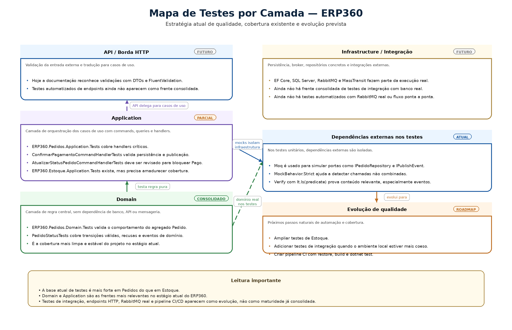
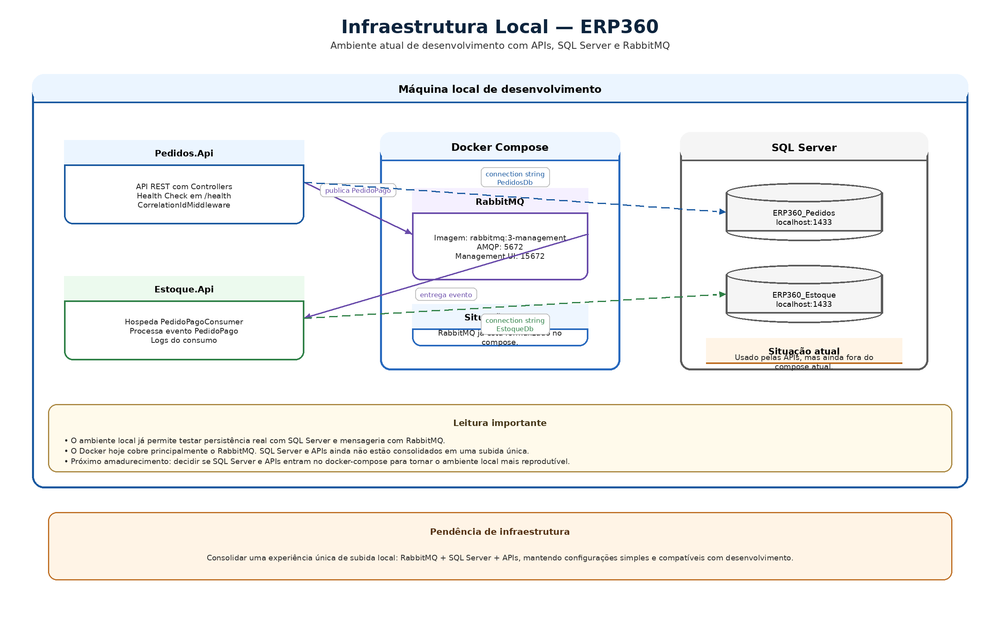

# 08. Qualidade, Testes e Infraestrutura

## Artefatos visuais desta seção

### Mapa de Testes por Camada

### Infraestrutura Local

## 8.1 Objetivo desta seção

Esta seção consolida a frente de qualidade do ERP360 a partir do que já existe no projeto e do que ainda precisa evoluir. O foco aqui é apresentar:

- a estratégia de testes adotada

- a distribuição dos testes por camada

- o papel de xUnit e Moq

- a infraestrutura local atual

- o uso de SQL Server e RabbitMQ

- os próximos passos naturais em observabilidade e CI/CD

Esta seção diferencia com clareza:

- o que já está implementado

- o que está parcialmente preparado

- o que entra como evolução futura

## 8.2 Estratégia de testes

A estratégia de testes do ERP360 acompanha a arquitetura da solução. Os testes não foram concentrados em um único projeto genérico, nem colocados todos no mesmo nível de abstração. Em vez disso, a estrutura atual já separa a validação conforme o tipo de responsabilidade exercida no sistema.

A lógica adotada até aqui é:

- domínio é testado como domínio

- handlers da aplicação são testados como aplicação

- dependências externas são isoladas por mock

- o foco está nos pontos mais sensíveis do fluxo principal

**Objetivos da estratégia atual**

- validar o comportamento do agregado Pedido

- validar a orquestração dos handlers de aplicação

- garantir que persistência e publicação sejam acionadas corretamente

- reduzir regressões silenciosas ao evoluir fluxo, regras e integração

**Leitura importante**

A estratégia atual está correta para o estágio do projeto, mas ainda é mais madura em Pedidos do que em Estoque. Essa assimetria já aparece no código e deve continuar sendo tratada como pendência real do projeto.

## 8.3 Testes por camada

### 8.3.1 Testes de domínio

Hoje o projeto já possui um núcleo claro de testes de domínio em:

- ERP360.Pedidos.Domain.Tests

**Exemplo principal identificado**

- PedidoStatusTests

**O que esses testes validam**

- transições válidas de status

- recusa de transições inválidas

- passagem de Rascunho para AguardandoPagamento

- passagem para Pago

- cancelamento manual

- produção de eventos de domínio em mudanças relevantes

**Papel desses testes**

Esses testes provam que o agregado Pedido responde corretamente às operações do domínio, independentemente de banco, API ou mensageria.

**Observação importante**

Como a matriz final de estados ainda possui decisões em aberto, esses testes também funcionam como sinalizadores de regras que ainda precisam ser consolidadas no projeto.

### 8.3.2 Testes de Application — Pedidos

O projeto já possui testes de aplicação em:

- ERP360.Pedidos.Application.Tests

**Classes mais relevantes identificadas**

- ConfirmarPagamentoCommandHandlerTests

- AtualizarStatusPedidoCommandHandlerTests

**O que esses testes validam**

- busca de pedido no repositório

- chamada da operação correta do domínio

- persistência do novo estado

- publicação de evento quando necessária

- tratamento de pedido inexistente

- tratamento de status inválido

- tratamento de recusa do domínio

**Papel desses testes**

Eles validam a orquestração dos casos de uso, isto é:

- como a Application conversa com o domínio

- como usa repositório

- como usa o barramento

- como responde a sucesso e falha

**Observação importante**

Esses testes ainda precisam ser revisados quando o código for alinhado à decisão já consolidada na documentação de que:

- ConfirmarPagamento é o único caminho para Pago

- AtualizarStatus não deve marcar pagamento nem publicar PedidoPago

### 8.3.3 Testes de Application — Estoque

O projeto já possui a estrutura:

- ERP360.Estoque.Application.Tests

Isso é positivo do ponto de vista arquitetural, porque mostra que o contexto de Estoque também foi pensado com espaço para validação isolada da Application.

**Situação atual**

No entanto, essa frente ainda não apresenta o mesmo nível de maturidade de cobertura encontrado em Pedidos.

**Papel esperado dessa suíte**

Ela deve cobrir, principalmente:

- reserva com item existente e saldo suficiente

- falha quando o item não existe

- falha quando a quantidade é inválida

- falha quando não há saldo suficiente

- persistência correta da reserva

**Observação importante**

Existe um ponto que já apareceu como pendência: o projeto de testes de Estoque precisa ser revisado quanto às referências e ao nível real de alinhamento com ERP360.Estoque.Application.

### 8.3.4 O que ainda não aparece como frente consolidada de testes

No estado atual do ERP360, ainda não aparece consolidado coma seção de qualidade:

- testes de integração com banco real

- testes de integração com RabbitMQ real

- testes ponta a ponta entre Pedidos e Estoque

- testes automatizados da borda HTTP

- pipeline automatizado com execução de testes

**Leitura importante**

Isso não invalida a estratégia atual. Apenas mostra que a base de qualidade foi priorizada primeiro no núcleo do sistema:

- domínio

- handlers

- comportamento crítico do fluxo principal

## 8.4 Papel do xUnit e do Moq

### 8.4.1 xUnit

O xUnit é o framework-base de testes do ERP360.

**Função prática no projeto**

Ele fornece:

- estrutura dos testes

- atributos como [Fact]

- execução das suítes

- integração com o ecossistema .NET de testes

**Por que faz sentido aqui**

O xUnit combina bem com a estrutura atual do projeto porque:

- favorece testes unitários diretos

- funciona bem com dotnet test

- se integra naturalmente à separação por projeto e por camada

### 8.4.2 Moq

O Moq é usado para isolar dependências externas da unidade sob teste.

**Função prática no projeto**

Ele aparece principalmente no teste de handlers que dependem de interfaces como:

- IPedidoRepository

- IPublishEvent

**Como ele é usado no ERP360**

A abordagem já adotada no projeto mostra escolhas importantes, como:

- MockBehavior.Strict

- Verify(...)

- It.IsAny<T>()

- It.Is<T>(predicate)

**O que isso revela**

O Moq não está sendo usado apenas para “simular dependência”, mas para provar comportamento:

- se o repositório foi chamado

- se o evento foi publicado

- se foi publicado com o conteúdo esperado

- se chamadas indevidas deixaram de acontecer

Isso é especialmente importante nos handlers, porque eles são o ponto de orquestração entre domínio, persistência e integração.

## 8.5 Infraestrutura local com Docker

### 8.5.1 Situação atual

A infraestrutura local do ERP360 já foi parcialmente formalizada com Docker, mas ainda não está consolidada como ambiente único de subida.

**O que já existe**

- docker-compose.yml

- subida do RabbitMQ

- suporte ao fluxo local de mensageria

**O que isso já resolve**

- permite publicar PedidoPago

- permite consumir o evento em Estoque

- sustenta a integração assíncrona local entre os contextos

### 8.5.2 RabbitMQ com Docker Compose

O compose atual sobe o RabbitMQ com a imagem:

- rabbitmq:3-management

**Portas expostas**

- 5672 — comunicação AMQP da aplicação

- 15672 — painel web de administração

**Credenciais atuais**

- usuário: guest

- senha: guest

**Papel no projeto**

O RabbitMQ é o elemento que sustenta, localmente, a ponte entre:

- confirmação de pagamento em Pedidos

- reserva em Estoque

**Leitura importante**

No estágio atual do projeto, o Docker atende bem a mensageria, mas ainda não representa uma infraestrutura local completa da solução.

### 8.5.3 SQL Server no ambiente local

O ERP360 usa SQL Server como banco relacional dos contextos já persistidos.

**Onde isso aparece**

- Pedidos.Api/appsettings.Development.json

- Estoque.Api/appsettings.json

**Bases já utilizadas**

- ERP360_Pedidos

- ERP360_Estoque

**Papel no projeto**

O SQL Server sustenta:

- persistência do módulo de Pedidos

- persistência do módulo de Estoque

- migrations dos dois contextos

- health check de banco no contexto de Pedidos

**Observação importante**

Embora o SQL Server já faça parte do ambiente real do projeto, ele ainda não está formalizado no docker-compose.yml atual. Isso reforça a leitura de que a infraestrutura local está funcional, mas não totalmente amadurecida.

### 8.5.4 Leitura consolidada da infraestrutura local

Hoje o ERP360 já possui dois pilares importantes do ambiente de desenvolvimento:

**SQL Server**

Responsável por:

- manter o estado persistido dos módulos

- sustentar o banco de Pedidos

- sustentar o banco de Estoque

**RabbitMQ**

Responsável por:

- transportar PedidoPago

- desacoplar confirmação de pagamento e reserva

- viabilizar a integração assíncrona entre contextos

**Ponto de atenção**

O ambiente local ainda não está centralizado em uma experiência única de subida. Hoje:

- RabbitMQ está no compose

- SQL Server é usado, mas está fora do compose atual

- as APIs também não estão containerizadas

Essa pendência já deve ser tratada como parte do amadurecimento da infraestrutura.

## 8.6 Observabilidade no estado atual

### 8.6.1 O que já existe

No contexto de Pedidos, o projeto já possui uma base inicial de observabilidade:

- CorrelationIdMiddleware

- endpoint /health

- AddDbContextCheck<PedidosDbContext>()

- logs configurados

- rastreabilidade básica da requisição

No contexto de Estoque, a instrumentação atual está mais enxuta e aparece principalmente por:

- logs do consumer

- fluxo de processamento do evento

### 8.6.2 O que isso significa

O ERP360 já não é completamente cego do ponto de vista operacional. Existe uma base para:

- rastrear entrada HTTP em Pedidos

- verificar saúde básica da aplicação e do banco

- acompanhar o consumo do evento em Estoque

### 8.6.3 O que ainda não está consolidado

Ainda não aparece como parte madura da solução:

- tracing distribuído entre Pedidos e Estoque

- propagação estruturada de correlação entre HTTP, publish e consume

- OpenTelemetry

- métricas de aplicação e de negócio

- dashboards

- instrumentação mais homogênea entre os dois contextos

## 8.7 Evolução futura com observabilidade

A evolução mais natural da observabilidade no ERP360 pode seguir esta ordem:

**Etapa 1 — consolidar o básico**

- padronizar melhor os logs entre Pedidos e Estoque

- reforçar health checks também em Estoque

- tornar a correlação mais uniforme

**Etapa 2 — conectar os fluxos**

- propagar correlação do pagamento até a reserva

- permitir leitura ponta a ponta do caminho entre requisição, evento e consumo

**Etapa 3 — amadurecer a telemetria**

- tracing distribuído

- OpenTelemetry

- painéis e telemetria mais completos

**Leitura importante**

Nada disso precisa entrar prematuramente. O núcleo do projeto ainda pede amadurecimento em áreas mais básicas antes de avançar para uma observabilidade distribuída mais sofisticada.

## 8.8 Evolução futura com CI/CD

Hoje o ERP360 ainda não possui pipeline automatizado consolidado no repositório. Isso é compatível com o estágio atual da solução, já que a prioridade até aqui foi estruturar o sistema e validar seus fluxos principais.

A evolução mais natural em CI/CD seria:

### 8.8.1 CI — integração contínua básica

Começar com um pipeline que execute:

- restore

- build

- testes unitários

**Objetivo**

Garantir que novas alterações não quebrem silenciosamente o projeto.

### 8.8.2 Qualidade automatizada

Depois do pipeline básico, faz sentido adicionar:

- validação de formatação

- análise estática

- cobertura mínima

- falha do pipeline em testes críticos

**Objetivo**

Transformar qualidade em prática repetível e verificável.

### 8.8.3 CD — entrega contínua

Em estágio mais avançado, o projeto pode evoluir para:

- publicação automatizada das APIs

- versionamento de artefatos

- ambientes separados

- execução mais próxima de deploy real

**Objetivo**

Ampliar a maturidade operacional da solução.

## 8.9 Leitura consolidada da qualidade atual do ERP360

Hoje o ERP360 já possui uma base concreta de qualidade e infraestrutura, ainda que incompleta.

**Já existe de forma prática**

- testes de domínio de Pedidos

- testes de Application em Pedidos

- estrutura preparada para testes em Estoque

- xUnit como framework-base

- Moq para isolamento de dependências externas

- RabbitMQ local via Docker Compose

- SQL Server como persistência real

- health check em Pedidos

- correlação e logs básicos

**Ainda precisa amadurecer**

- cobertura real de Estoque

- alinhamento da suíte com a decisão sobre pagamento

- infraestrutura local mais coesa

- observabilidade mais uniforme

- pipeline CI/CD

## 8.10 Pendências reveladas por esta seção

**O que precisa ser mudado**

- alinhar os testes de AtualizarStatus e ConfirmarPagamento com a regra consolidada de pagamento

- revisar o projeto ERP360.Estoque.Application.Tests

- ampliar a cobertura real do contexto de Estoque

**O que precisa ser decidido**

- o SQL Server passará a entrar no compose?

- o Docker continuará apenas como apoio parcial ou passará a representar a infraestrutura local da solução?

- qual será o próximo passo real em observabilidade: health checks em Estoque, correlação ponta a ponta ou tracing?

**O que está provisório**

- a frente de testes de Estoque ainda está menos madura

- o Docker ainda cobre apenas parte do ambiente local

- a observabilidade ainda está mais forte em Pedidos do que em Estoque

**O que pode ficar para depois sem comprometer o núcleo**

- OpenTelemetry

- tracing distribuído completo

- dashboards e métricas avançadas

- pipeline de CD mais completo

## 8.11 Referências internas úteis

Para a arquitetura das camadas e dos contratos que essa estratégia de testes e infraestrutura precisa sustentar, ver Seção 06 — Arquitetura da Solução.

Para a materialização concreta de projetos, handlers, repositórios e componentes técnicos envolvidos nesses testes, ver Seção 09 — Modelo de Classes de Projeto e Implementação.

Para o histórico das decisões, pendências e próximos passos relacionados a infraestrutura, observabilidade e evolução do projeto, ver Seção 10 — Histórico de Evolução e Decisões Importantes.

## 8.12 Fechamento da seção

A frente de qualidade do ERP360 já está apoiada em uma base correta para o estágio atual do projeto:

- xUnit como estrutura de testes

- Moq para isolamento e prova de comportamento

- testes de domínio e de aplicação nos pontos mais sensíveis

- SQL Server como persistência real

- RabbitMQ como broker da integração

- Docker já presente para a mensageria local

Ao mesmo tempo, esta seção deixa claro que a solução ainda precisa amadurecer em:

- cobertura de Estoque

- alinhamento dos testes com o fluxo oficial de pagamento

- consolidação da infraestrutura local

- observabilidade mais consistente

- automação de qualidade com CI/CD

---

[Voltar ao índice](./README.md)
