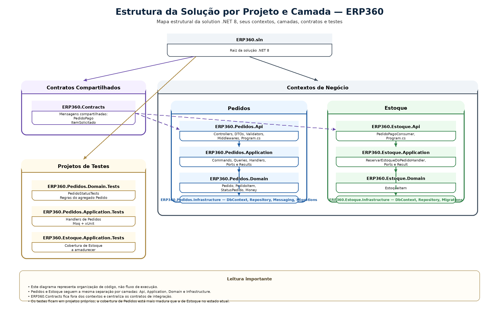

# 09. Modelo de Classes de Projeto e Implementação

## Artefatos visuais desta seção

### Estrutura da Solução por Projeto e Camada

## 9.1 Objetivo desta seção

Esta seção descreve a implementação do ERP360 a partir da estrutura real da solução. O foco aqui é mostrar como a arquitetura e os fluxos do sistema foram materializados em:

- projetos

- pastas

- camadas

- classes e componentes principais

- relação entre controllers, commands, queries, handlers, repositories, consumers, contracts e dbcontexts

Ao final, a seção também consolida uma sequência profissional de construção do código, servindo como roteiro de implementação do ERP360.

Esta seção não substitui a arquitetura nem o modelo físico. Seu papel é mostrar como o desenho da solução virou código organizado no repositório.

## 9.2 Visão geral da implementação

No estado atual, o ERP360 está organizado como uma solução .NET 8 com múltiplos projetos separados por:

- contexto de negócio

- camada técnica

- finalidade transversal

A estrutura principal da solução está assim:

**ERP360.sln**

**src/**

**ERP360.Contracts**

**ERP360.Pedidos.Api**

**ERP360.Pedidos.Application**

**ERP360.Pedidos.Domain**

**ERP360.Pedidos.Infrastructure**

**ERP360.Estoque.Api**

**ERP360.Estoque.Application**

**ERP360.Estoque.Domain**

**ERP360.Estoque.Infrastructure**

**tests/**

**ERP360.Pedidos.Domain.Tests**

**ERP360.Pedidos.Application.Tests**

**ERP360.Estoque.Application.Tests**

**Leitura importante**

Essa estrutura já mostra duas decisões fortes do projeto:

- separar a solução por contexto

- separar cada contexto por camada

Com isso, o ERP360 evita a forma mais comum de crescimento desorganizado em um único projeto grande com pastas genéricas demais.

## 9.3 MODELO DE CLASSES DE PROJETO

### 9.3.1 Projeto ERP360.Contracts

**Papel na solução**

Centraliza os contratos compartilhados de integração entre contextos.

**Estrutura principal**

- Pedidos/ItemSolicitado.cs

- Pedidos/PedidoPago.cs

**Componentes principais**

**PedidoPago**

Representa a mensagem publicada após a confirmação de pagamento.

**ItemSolicitado**

Representa cada item que o contexto de Estoque precisa considerar ao processar a reserva.

**Leitura de implementação**

Esse projeto existe para evitar duplicidade de contratos entre publisher e consumer e já cumpre esse papel no fluxo principal implementado.

### 9.3.2 Projeto ERP360.Pedidos.Api

**Papel na solução**

É a borda HTTP do contexto de Pedidos.

**Estrutura principal**

- Controllers/

- Contracts/

- Validation/

- Middlewares/

- Pagination/

- Program.cs

- appsettings*.json

**Componentes principais**

**PedidosController**

Controller principal do módulo de Pedidos.

Hoje ele concentra endpoints para:

- criar pedido

- consultar pedido por id

- atualizar status

- confirmar pagamento

**DTOs de entrada e saída**

A API possui contratos próprios de borda, separados do domínio e da aplicação.

Exemplos mais relevantes:

- CriarPedidoDto

- CriarPedidoItemDto

- AtualizarStatusPedidoDto

- PedidoDetalhesDto

- PedidoItemDetalheDto

**Validators**

A borda usa FluentValidation para validar entrada.

Exemplos:

- CriarPedidoDtoValidator

- CriarPedidoItemDtoValidator

**CorrelationIdMiddleware**

Middleware de rastreabilidade do contexto de Pedidos.

**Program.cs**

Ponto de composição da API:

- controllers

- MediatR

- FluentValidation

- EF Core

- health checks

- mensageria

- DI

- Swagger em desenvolvimento

**Leitura de implementação**

Pedidos.Api está corretamente posicionado como entrada do contexto: recebe requisições, valida contratos de borda e delega o fluxo para a Application.

### 9.3.3 Projeto ERP360.Pedidos.Application

**Papel na solução**

Executa os casos de uso do contexto de Pedidos.

**Estrutura principal**

- Abstractions/

- Common/

- Pedidos/Commands/

- Pedidos/Queries/

- Pedidos/Policies/

**Componentes principais**

**Abstrações**

- IPedidoRepository

- IEstoqueReadOnlyService

- IPublishEvent

Essas interfaces representam as portas usadas pelos handlers.

**Result**

Tipo de retorno da camada de aplicação para expressar sucesso ou falha de forma controlada.

**Commands e handlers principais**

- CriarPedidoCommand / CriarPedidoCommandHandler

- ConfirmarPagamentoCommand / ConfirmarPagamentoCommandHandler

- AtualizarStatusPedidoCommand / AtualizarStatusPedidoCommandHandler

**Query principal**

- ObterPedidoPorIdQuery

- ObterPedidoPorIdQueryHandler

**Estruturas auxiliares**

- ReservaPedidoPolicy

- EstoqueReadOnlyStub

**Observação importante**

EstoqueReadOnlyStub ainda representa uma implementação provisória. A porta arquitetural já existe, mas esse ponto ainda pede amadurecimento ou remoção, conforme a direção escolhida para o projeto.

**Observação importante 2**

AtualizarStatusPedidoCommandHandler ainda precisa refletir integralmente a decisão já consolidada na documentação de que Pago só pode ser alcançado por ConfirmarPagamento.

### 9.3.4 Projeto ERP360.Pedidos.Domain

**Papel na solução**

Guarda o núcleo de comportamento do pedido.

**Estrutura principal**

- Entities/

- Enums/

- Events/

- ValueObjects/

- Common/

- Primitives/

**Componentes principais**

**Entidades**

- Pedido

- PedidoItem

**Enum**

- StatusPedido

**Value Object**

- Money

**Eventos de domínio**

- PedidoCriado

- StatusPedidoAlterado

- PedidoCancelado

**Estruturas de apoio**

- DomainResult

- IDomainEvent

**Leitura de implementação**

A classe mais importante desse projeto é Pedido, porque ela concentra:

- identidade

- itens

- total

- status

- eventos do ciclo

- validação das transições

### 9.3.5 Projeto ERP360.Pedidos.Infrastructure

**Papel na solução**

Implementa persistência e mensageria do contexto de Pedidos.

**Estrutura principal**

- Persistence/

- Messaging/

- Migrations/

- InMemory/

**Componentes principais**

**Persistência**

- PedidosDbContext

- PedidoRepository

- PedidoConfiguration

- PedidoItemConfiguration

**Mensageria**

- RabbitMqEventBus

**Elemento auxiliar / legado de transição**

- EventCollector

**Observação importante**

EventCollector precisa ser classificado com mais clareza no projeto final:

- permanece com papel ativo

- ou é removido como vestígio de etapa anterior

### 9.3.6 Projeto ERP360.Estoque.Api

**Papel na solução**

É a borda de integração do contexto de Estoque no recorte atual do sistema.

**Estrutura principal**

- Messaging/Consumers/

- Program.cs

- appsettings.json

**Componente principal**

**PedidoPagoConsumer**

Consumer que recebe o evento PedidoPago e encaminha o processamento para a Application do contexto de Estoque.

**Leitura de implementação**

A API de Estoque está mais enxuta do que a de Pedidos. No momento, seu foco principal é hospedar o fluxo reativo à confirmação de pagamento.

### 9.3.7 Projeto ERP360.Estoque.Application

**Papel na solução**

Executa o caso de uso de reserva de estoque.

**Estrutura principal**

- Abstractions/

- Common/

- Reservas/Command/

**Componentes principais**

**Abstração**

- IEstoqueRepository

**Resultado**

- Result

**Comando principal**

- ReservarEstoqueDoPedidoCommand

**Handler principal**

- ReservarEstoqueDoPedidoCommandHandler

**Leitura de implementação**

Esse handler concentra a orquestração do fluxo de reserva:

- valida os itens recebidos

- localiza o item de estoque

- verifica disponibilidade

- aplica a reserva

- persiste o novo estado

### 9.3.8 Projeto ERP360.Estoque.Domain

**Papel na solução**

Guarda a regra central de estoque.

**Estrutura principal**

- Entities/EstoqueItem.cs

**Componente principal**

**EstoqueItem**

Entidade que controla:

- ProdutoId

- QuantidadeDisponivel

- possibilidade de reserva

- redução de saldo

**Leitura de implementação**

O domínio de Estoque é mais enxuto, o que está alinhado com o escopo atual do contexto.

### 9.3.9 Projeto ERP360.Estoque.Infrastructure

**Papel na solução**

Implementa a persistência do contexto de Estoque.

**Estrutura principal**

- Persistence/

- Migrations/

- InMemory/

**Componentes principais**

**Persistência principal**

- EstoqueDbContext

- EstoqueRepository

- EstoqueItemConfiguration

**Estrutura provisória / histórica**

- EstoqueRepositoryInMemory

**Observação importante**

EstoqueRepositoryInMemory precisa ser classificado no projeto consolidado:

- permanece como apoio legítimo

- ou sai como artefato de transição

### 9.3.10 Projetos de teste

**ERP360.Pedidos.Domain.Tests**

Focado no comportamento do domínio de Pedidos.

Exemplo central:

- PedidoStatusTests

**ERP360.Pedidos.Application.Tests**

Focado na orquestração dos handlers do contexto de Pedidos.

Exemplos centrais:

- ConfirmarPagamentoCommandHandlerTests

- AtualizarStatusPedidoCommandHandlerTests

**ERP360.Estoque.Application.Tests**

Projeto de testes da Application de Estoque já presente na solução.

**Observação importante**

Esse projeto de testes ainda precisa ser revisado quanto ao apontamento correto das referências e ao nível real de cobertura que ele já possui.

## 9.4 PRINCIPAIS COMPONENTES TÉCNICOS

### 9.4.1 Controllers

**Principal**

- PedidosController

**Papel**

Receber entrada HTTP, montar commands/queries, chamar MediatR e devolver resposta apropriada na borda.

### 9.4.2 Commands

**Em Pedidos**

- CriarPedidoCommand

- ConfirmarPagamentoCommand

- AtualizarStatusPedidoCommand

- ConfirmarPedidoCommand (presente na estrutura e ainda precisando de classificação quanto ao papel final no fluxo oficial)

**Em Estoque**

- ReservarEstoqueDoPedidoCommand

### 9.4.3 Queries

**Em Pedidos**

- ObterPedidoPorIdQuery

No estado atual, esta é a query mais claramente consolidada do contexto.

### 9.4.4 Handlers

**Em Pedidos**

- CriarPedidoCommandHandler

- ConfirmarPagamentoCommandHandler

- AtualizarStatusPedidoCommandHandler

- ObterPedidoPorIdQueryHandler

**Em Estoque**

- ReservarEstoqueDoPedidoCommandHandler

### 9.4.5 Repositories

**Interfaces**

- IPedidoRepository

- IEstoqueRepository

**Implementações principais**

- PedidoRepository

- EstoqueRepository

**Implementações provisórias ou históricas**

- EstoqueRepositoryInMemory

### 9.4.6 Consumers

**Principal**

- PedidoPagoConsumer

**Papel**

Receber PedidoPago, converter a mensagem em comando interno e acionar a Application do contexto de Estoque.

### 9.4.7 Contracts

**Principais**

- PedidoPago

- ItemSolicitado

**Papel**

Servir de fronteira formal entre o contexto que publica o fato de pagamento e o contexto que reage reservando estoque.

### 9.4.8 DbContexts

**Em Pedidos**

- PedidosDbContext

**Em Estoque**

- EstoqueDbContext

**Papel**

Materializar a persistência relacional de cada contexto.

## 9.5 ESTRUTURA POR PROJETO, PASTA E CAMADA

**Contexto Pedidos**

**Api**

- Controllers

- Contracts

- Validation

- Middlewares

- Pagination

- Program.cs

**Application**

- Abstractions

- Common

- Pedidos/Commands

- Pedidos/Queries

- Pedidos/Policies

**Domain**

- Entities

- Enums

- Events

- Primitives

- ValueObjects

- Common

**Infrastructure**

- Persistence

- Messaging

- Migrations

- InMemory

**Contexto Estoque**

**Api**

- Messaging/Consumers

- Program.cs

**Application**

- Abstractions

- Common

- Reservas/Command

**Domain**

- Entities

**Infrastructure**

- Persistence

- Migrations

- InMemory

**Contratos**

- Pedidos/PedidoPago.cs

- Pedidos/ItemSolicitado.cs

**Testes**

- Pedidos.Domain.Tests

- Pedidos.Application.Tests

- Estoque.Application.Tests

## 9.6 LEITURA CONSOLIDADA DA IMPLEMENTAÇÃO

Do ponto de vista do código, o ERP360 já permite uma leitura ponta a ponta do fluxo principal:

- a borda HTTP recebe a requisição

- o controller monta command/query

- o MediatR encaminha a execução

- a Application coordena o caso de uso

- o Domain valida a regra central

- o repositório persiste o estado

- o barramento publica o evento quando necessário

- o consumer recebe a mensagem no contexto de Estoque

- a Application de Estoque executa a reserva

- o Domain de Estoque aplica a regra

- a infraestrutura persiste o novo saldo

Essa leitura confirma que a estrutura por projetos e classes acompanha o comportamento real do sistema.

## 9.7 SEQUÊNCIA DE CONSTRUÇÃO DO CÓDIGO — ROTEIRO PROFISSIONAL DE IMPLEMENTAÇÃO

Abaixo está a sequência recomendada para construir o ERP360 de forma consistente com o desenho atual da solução.

**Etapa 1 — Definir a solução e os contextos**

Criar a solução e separar os contextos principais:

- Pedidos

- Estoque

- Contracts

- Testes

**Objetivo**

Começar pelas fronteiras corretas antes do fluxo.

**Etapa 2 — Estruturar os projetos por camada**

Criar, em cada contexto:

- Api

- Application

- Domain

- Infrastructure

**Objetivo**

Fixar responsabilidades técnicas antes da implementação dos casos de uso.

**Etapa 3 — Modelar o domínio de Pedidos**

Implementar:

- StatusPedido

- Money

- PedidoItem

- Pedido

- eventos de domínio

- DomainResult

**Objetivo**

Criar o núcleo semântico do sistema antes da persistência e da integração.

**Etapa 4 — Modelar o domínio de Estoque**

Implementar:

- EstoqueItem

com regra mínima de:

- disponibilidade

- reserva

**Objetivo**

Preparar o contexto reativo que receberá o pagamento confirmado.

**Etapa 5 — Definir as portas da Application**

Criar as interfaces usadas pelos handlers.

**Em Pedidos**

- IPedidoRepository

- IEstoqueReadOnlyService

- IPublishEvent

**Em Estoque**

- IEstoqueRepository

**Objetivo**

Permitir que a orquestração da Application seja escrita sem depender da infraestrutura concreta.

**Etapa 6 — Implementar os casos de uso principais de Pedidos**

Codar:

- criação de pedido

- consulta por id

- confirmação de pagamento

- atualização de status operacional

**Objetivo**

Materializar o fluxo principal do sistema.

**Observação importante**

Nessa etapa, a forma consolidada do projeto já deve respeitar a decisão de que:

- ConfirmarPagamento é o único caminho para Pago

- AtualizarStatus cuida apenas dos estados operacionais

**Etapa 7 — Implementar o caso de uso principal de Estoque**

Criar:

- ReservarEstoqueDoPedidoCommand

- ReservarEstoqueDoPedidoCommandHandler

**Objetivo**

Preparar a reação ao evento de integração.

**Etapa 8 — Criar os contratos de integração**

No projeto ERP360.Contracts, implementar:

- PedidoPago

- ItemSolicitado

**Objetivo**

Fechar a fronteira formal entre os contextos antes da mensageria concreta.

**Etapa 9 — Implementar a borda HTTP de Pedidos**

Criar:

- controller

- DTOs

- validators

- configuração de MediatR

- health check

- middleware de correlação

**Objetivo**

Tornar os casos de uso acessíveis de forma estruturada.

**Etapa 10 — Implementar a persistência real**

Na Infrastructure de cada contexto, criar:

- DbContext

- configurações EF Core

- repositórios

- migrations

**Objetivo**

Levar o sistema à persistência real em banco relacional.

**Etapa 11 — Implementar a mensageria**

Criar:

- RabbitMqEventBus

- PedidoPagoConsumer

- configuração MassTransit/RabbitMQ

**Objetivo**

Fechar o fluxo distribuído entre pagamento e reserva.

**Etapa 12 — Validar o fluxo ponta a ponta**

Validar:

- criação do pedido

- consulta

- confirmação de pagamento

- publicação do evento

- consumo em Estoque

- reserva

- persistência final

**Objetivo**

Garantir que arquitetura, domínio, persistência e integração convergem no mesmo fluxo real.

**Etapa 13 — Cobrir os pontos críticos com testes**

Criar testes para:

- domínio de Pedidos

- handlers de Pedidos

- handlers de Estoque

**Objetivo**

Proteger as regras mais sensíveis da solução.

**Etapa 14 — Endurecer a infraestrutura de desenvolvimento**

Consolidar:

- RabbitMQ local

- SQL Server local

- Docker de forma mais coesa

- health checks

- logs básicos

**Objetivo**

Aumentar a reprodutibilidade do ambiente local.

**Etapa 15 — Revisar coerência final do fluxo**

Revisar:

- duplicidades de responsabilidade

- alinhamento entre casos de uso

- limpeza de componentes provisórios

- coerência entre código, testes e documentação

**Objetivo**

Encerrar o núcleo do sistema com menos ruído e mais clareza semântica.

## 9.8 REFERÊNCIAS INTERNAS ÚTEIS

Para a leitura arquitetural das camadas e bounded contexts que esta implementação materializa, ver Seção 06 — Arquitetura da Solução.

Para o modelo físico correspondente aos componentes persistidos aqui descritos, ver Seção 07 — Modelo Físico de Dados.

Para a estratégia de testes, infraestrutura local e evolução operacional da solução, ver Seção 08 — Qualidade, Testes e Infraestrutura.

Para o histórico das mudanças de rota, componentes provisórios e pendências de limpeza do projeto, ver Seção 10 — Histórico de Evolução e Decisões Importantes.

## 9.9 Fechamento da seção

O ERP360 já possui uma estrutura de implementação suficientemente clara para ser lida como solução modular real. A separação por projetos, contextos e camadas está refletida no código, e os principais componentes técnicos já existem com nomes e responsabilidades reconhecíveis.

Esta seção funciona como mapa da implementação atual do sistema e também como roteiro profissional de construção do código, permitindo enxergar tanto o estado presente do projeto quanto a ordem coerente de sua evolução técnica.

---

[Voltar ao índice](./README.md)
