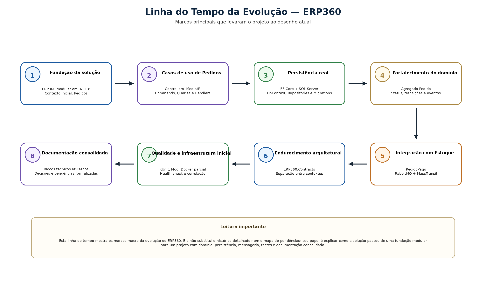
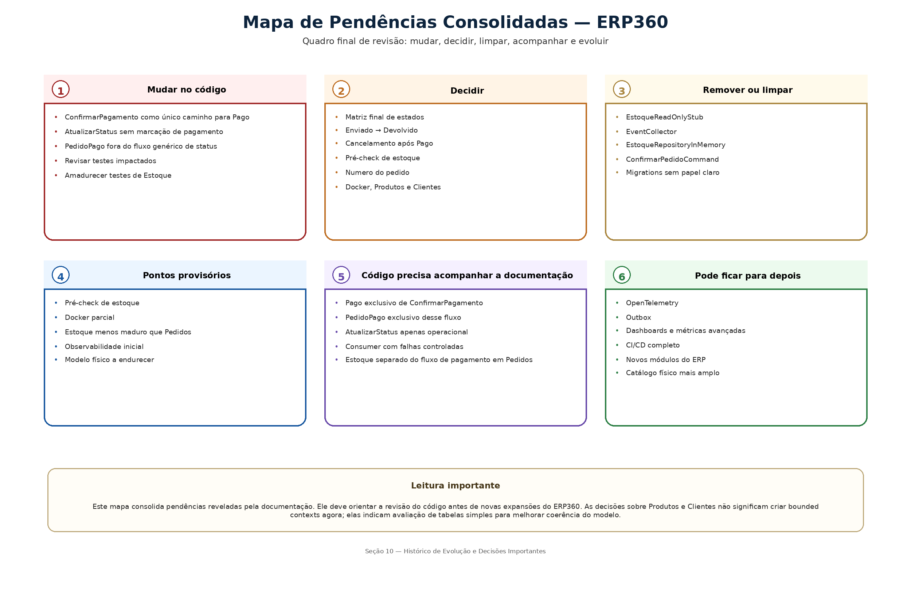

# 10. Histórico de Evolução e Decisões Importantes

## Artefatos visuais desta seção

### Linha do Tempo da Evolução

### Mapa de Pendências Consolidadas

## 10.1 Objetivo desta seção

Esta seção registra a evolução do ERP360 até o estado atual do projeto, consolidando:

- evolução por etapas

- principais decisões técnicas

- mudanças de rota

- problemas reais enfrentados

- soluções adotadas

- próximos passos do roadmap

- pendências reveladas pela documentação

O objetivo aqui é mostrar como o sistema chegou ao desenho atual e quais ajustes ainda precisam ser feitos para endurecer o projeto.

## 10.2 Evolução por etapas

**Etapa 1 — Fundação da solução**

O ERP360 começou com a definição do seu recorte principal: um sistema modular em .NET 8, organizado por contexto de negócio e por camadas técnicas. Desde o início, o fluxo de Pedidos foi escolhido como núcleo do projeto.

**Resultado da etapa**

- definição da solução

- definição dos contextos iniciais

- organização em camadas

- base tecnológica do projeto

**Etapa 2 — Estruturação dos casos de uso de Pedidos**

O projeto consolidou os primeiros fluxos do contexto de Pedidos, com destaque para criação e consulta. A separação entre command e query começou a ganhar forma concreta.

**Resultado da etapa**

- fluxo de leitura estruturado

- controller mais fino

- avanço prático de CQRS com MediatR

**Etapa 3 — Persistência real**

O projeto saiu da persistência provisória e passou a operar com EF Core + SQL Server, usando DbContext, repositórios e migrations para Pedidos e Estoque.

**Resultado da etapa**

- persistência relacional real

- modelo físico inicial

- repositórios concretos

**Etapa 4 — Fortalecimento do domínio**

O agregado Pedido passou a concentrar regras mais claras de negócio, especialmente em torno de status, transições e eventos de domínio.

**Resultado da etapa**

- domínio mais responsável

- ciclo do pedido mais explícito

- eventos de domínio consolidados

**Etapa 5 — Integração entre contextos**

A confirmação de pagamento passou a acionar o contexto de Estoque por meio de mensageria, com PedidoPago, RabbitMQ, MassTransit e consumer dedicado.

**Resultado da etapa**

- integração assíncrona implementada

- fluxo distribuído entre Pedidos e Estoque

- contratos compartilhados entre contextos

**Etapa 6 — Endurecimento arquitetural**

O projeto passou por uma fase de correção estrutural, com foco em reduzir duplicidade, clarificar contratos e tratar Estoque como contexto próprio.

**Resultado da etapa**

- separação mais clara entre contextos

- centralização de contratos em ERP360.Contracts

- arquitetura mais coerente

**Etapa 7 — Entrada de testes**

Com o fluxo principal mais estável, o projeto incorporou testes de domínio e de handlers com xUnit e Moq.

**Resultado da etapa**

- proteção inicial do núcleo de negócio

- validação de orquestração

- base de qualidade mais concreta

**Etapa 8 — Observabilidade inicial e documentação estruturada**

O projeto ganhou middleware de correlação, health check em Pedidos e uma documentação organizada por blocos, capaz de descrever o sistema e também revelar pendências reais.

**Resultado da etapa**

- maior rastreabilidade

- documentação técnica consolidada

- visão mais clara do estado real do projeto

## 10.3 Principais decisões técnicas

As decisões técnicas mais relevantes do ERP360 até aqui foram:

**Separação por contextos**

Pedidos e Estoque foram tratados como contextos diferentes, com responsabilidades próprias.

**Organização em camadas**

A solução foi dividida em Api, Application, Domain e Infrastructure.

**Controllers como borda principal**

A entrada principal do sistema foi padronizada com Controllers.

**CQRS com MediatR**

Commands e queries passaram a estruturar os casos de uso da Application.

**EF Core com SQL Server**

A persistência foi consolidada com banco real, migrations e repositórios concretos.

**RabbitMQ com MassTransit**

A integração entre pagamento e reserva foi formalizada por mensageria assíncrona.

**Contratos compartilhados**

ERP360.Contracts passou a ser a fronteira formal da comunicação entre contextos.

**Result pattern**

Falhas esperadas passaram a ser tratadas por resultado controlado, e não como exceção obrigatória em todo o fluxo.

## 10.4 Mudanças de rota

O ERP360 não evoluiu em linha reta. Algumas mudanças de rota foram importantes para endurecer o projeto.

**Da persistência provisória para banco real**

A solução deixou a fase puramente em memória e passou a operar com persistência relacional concreta.

**Da integração conceitual para integração implementada**

A relação entre Pedidos e Estoque deixou de ser apenas desenho arquitetural e passou a existir no código.

**Da duplicidade de contratos para centralização**

A criação de ERP360.Contracts corrigiu o risco de contratos paralelos entre publisher e consumer.

**Da ambiguidade de pagamento para um caminho único**

A documentação consolidou que ConfirmarPagamento deve ser o único caminho para levar o pedido a Pago e publicar PedidoPago.

## 10.5 Problemas reais enfrentados e soluções adotadas

**Sobreposição entre pagamento e atualização de status**

Havia dois caminhos possíveis para alcançar Pago, o que enfraquecia a semântica do fluxo e duplicava o gatilho de integração.

Solução adotada
Consolidar que ConfirmarPagamento é o único fluxo oficial para isso.

**Componentes provisórios ainda presentes no projeto**

Algumas partes da solução ainda refletem estágios intermediários, como:

- EstoqueReadOnlyStub

- EstoqueRepositoryInMemory

- EventCollector

- estruturas que ainda precisam ser classificadas como vigentes ou removíveis

Solução adotada
Tratar esses componentes como pendência formal de limpeza e classificação.

**Infraestrutura local parcialmente consolidada**

O Docker foi usado para RabbitMQ, mas a infraestrutura local ainda não está fechada como ambiente único de subida.

Solução adotada
Registrar essa frente como pendência real de infraestrutura, com direção clara de amadurecimento.

**Cobertura desigual entre contextos**

Pedidos avançou mais do que Estoque em testes, instrumentação e maturidade geral.

Solução adotada
Colocar o endurecimento de Estoque como prioridade de curto e médio prazo.

**Modelo físico ainda com decisões abertas**

O banco funciona, mas há decisões ainda não fechadas, como:

- índice para Numero

- possível unicidade de Numero

- tamanhos de coluna

- necessidade de tabela simples de Produtos

- necessidade futura de tabela simples de Clientes

Solução adotada
Tratar essas questões como pendências reais de persistência e evolução do domínio, sem inflar o escopo agora.

## 10.6 Próximos passos do roadmap

**Curto prazo**

- tornar ConfirmarPagamento o único caminho real para Pago

- remover a publicação de PedidoPago do fluxo genérico de atualização de status

- revisar os testes impactados

- revisar a suíte de Estoque

- classificar e limpar componentes provisórios

**Curto prazo operacional**

- amadurecer o uso de Docker

- decidir o destino do EstoqueReadOnlyStub

- reforçar observabilidade no contexto de Estoque

- revisar o papel da tabela simples de Produtos

**Médio prazo**

- ampliar cobertura de testes em Estoque

- criar pipeline básico de CI

- revisar índices e restrições do modelo físico

- endurecer a infraestrutura local

- avaliar tabela simples de Clientes

**Longo prazo**

- evolução de observabilidade distribuída

- maior robustez transacional da integração

- novos módulos do ERP

- ambientes e automações mais próximos de produção

## 10.7 Referências internas úteis

Para a formalização funcional das regras que motivaram várias das decisões desta seção, ver Seção 02 — Requisitos do Sistema.

Para o comportamento detalhado do fluxo de pagamento, estados e integração, ver Seção 05 — Diagramas Comportamentais.

Para a leitura arquitetural das decisões de contexto, contratos e camadas, ver Seção 06 — Arquitetura da Solução.

Para os pontos físicos de persistência que aparecem no roadmap e nas pendências, ver Seção 07 — Modelo Físico de Dados.

Para a situação atual de testes, infraestrutura, observabilidade e CI/CD, ver Seção 08 — Qualidade, Testes e Infraestrutura.

## 10.8 Fechamento da seção

O ERP360 evoluiu de uma base modular inicial para uma solução com fluxo real entre contextos, persistência concreta, mensageria, testes e documentação estruturada. A trajetória do projeto mostra amadurecimento técnico, mas também deixa claro que ainda existem ajustes importantes para endurecer o núcleo, limpar vestígios provisórios e consolidar melhor a infraestrutura.

## 10.9 APANHADO CONSOLIDADO DAS PENDÊNCIAS

### 10.9.1 O que precisa ser mudado no código

- tornar ConfirmarPagamento o único caminho real para Pago

- impedir AtualizarStatus de marcar pagamento

- remover a publicação de PedidoPago do fluxo genérico de atualização de status

- revisar os testes impactados

- corrigir a suíte de testes de Estoque

- endurecer mapeamentos físicos de Pedidos

### 10.9.2 O que precisa ser decidido

- matriz final de estados

- papel definitivo do pré-check de estoque

- força funcional de Numero

- nível de formalização da infraestrutura Docker

- criação de tabela simples de Produtos

- criação de tabela simples de Clientes

### 10.9.3 O que precisa ser removido ou limpo

- EstoqueReadOnlyStub

- EventCollector

- EstoqueRepositoryInMemory

- ConfirmarPedidoCommand, se não fizer mais parte do fluxo oficial

- migrations sem papel estrutural claro

### 10.9.4 O que está provisório

- pré-check de estoque

- parte da infraestrutura local

- assimetria de maturidade entre Pedidos e Estoque

- parte do endurecimento físico do banco

### 10.9.5 O que a documentação já consolidou, mas o código ainda não acompanhou

- Pago como estado exclusivo de ConfirmarPagamento

- PedidoPago como evento exclusivo desse fluxo

- AtualizarStatus como fluxo apenas operacional

### 10.9.6 O que pode ficar para depois sem comprometer o núcleo

- OpenTelemetry e tracing distribuído

- outbox

- dashboards e métricas avançadas

- CI/CD completo

- novos módulos

- catálogo físico mais amplo além do recorte atual

### 10.9.7 Revisões documentais pendentes

Depois da revisão das seções, as pendências documentais mais fortes foram reduzidas. Ainda assim, na consolidação final, será importante:

- reordenar a sequência de leitura para a ordem mais forte

- padronizar numeração e referências cruzadas

- revisar a versão final já no formato único do documento

---

[Voltar ao índice](./README.md)
